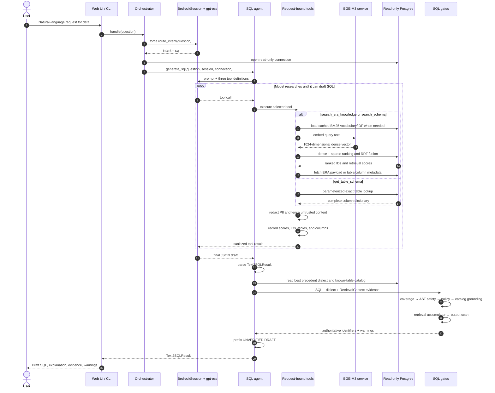
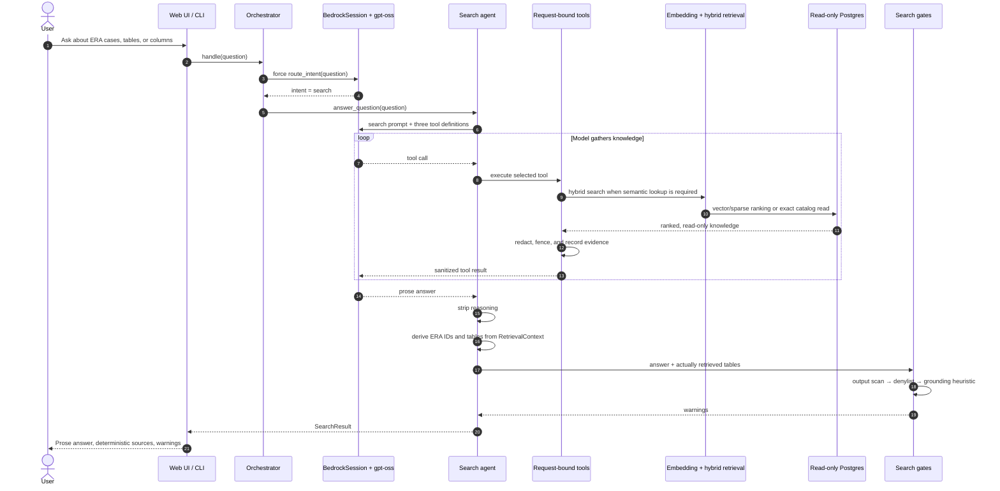

# Text-to-SQL Agent Architecture

## Purpose and operating boundary

The application accepts Indonesian or English questions and returns one of:

- a reviewable SQL draft;
- a prose answer about ERA precedents, tables, or columns; or
- an out-of-scope response.

It never executes generated SQL. Knowledge-base access uses a dedicated read-only
Postgres role, retrieved free text is redacted before it reaches the model, and all
generated output is inspected by code-enforced gates.

## End-to-end architecture

This is the complete request flow. It shows every agent, each agent's tools, retrieval
dependencies, Postgres access, gates, and response types.

```mermaid
flowchart LR
    U([User])

    subgraph CHANNELS["Request channels"]
        WEB["Web UI<br/>POST /api/chat"]
        CLI["CLI REPL<br/>handle(question)"]
    end

    subgraph ROUTING["Routing"]
        ORCH["Orchestrator<br/>single forced route_intent call"]
        ROUTER["Router classifier<br/>intent: sql | search | other"]
        FALLBACK["Out-of-scope fallback<br/>no agent or database call"]
        ORCH --> ROUTER
    end

    subgraph SQL_AGENT["SQL drafting agent"]
        SQL_LOOP["Strands SQL agent<br/>system prompt + conversation window"]
        SQL_MODEL["Text2SqlBedrockModel<br/>OpenAI ↔ Strands tool-call adapter"]
        SQL_PARSE["Parse final JSON<br/>Text2SQLResult"]
        SQL_LOOP <--> SQL_MODEL
        SQL_LOOP --> SQL_PARSE
    end

    subgraph SEARCH_AGENT["Knowledge search agent"]
        SEARCH_LOOP["Strands search agent<br/>search prompt + conversation window"]
        SEARCH_MODEL["Text2SqlBedrockModel<br/>OpenAI ↔ Strands tool-call adapter"]
        SEARCH_BUILD["Strip reasoning<br/>derive sources from RetrievalContext"]
        SEARCH_LOOP <--> SEARCH_MODEL
        SEARCH_LOOP --> SEARCH_BUILD
    end

    subgraph TOOLS["Tools bound separately to each agent request"]
        SQL_TOOLS["SQL agent tool set"]
        SEARCH_TOOLS["Search agent tool set"]
        ERA["search_era_knowledge(question)<br/>ERA precedents and precedent SQL"]
        SCHEMA["search_schema(concept)<br/>candidate tables rendered as DDL"]
        TABLE["get_table_schema(table_name)<br/>deterministic column dictionary"]
        SANITIZE["PII redaction<br/>untrusted-content fencing"]
        CTX["RetrievalContext<br/>calls, scores, IDs, tables, columns"]

        SQL_TOOLS --> ERA
        SQL_TOOLS --> SCHEMA
        SQL_TOOLS --> TABLE
        SEARCH_TOOLS --> ERA
        SEARCH_TOOLS --> SCHEMA
        SEARCH_TOOLS --> TABLE
        ERA --> SANITIZE --> CTX
        SCHEMA --> SANITIZE
        TABLE --> SANITIZE
    end

    subgraph RETRIEVAL["Retrieval layer"]
        HYBRID["hybrid_search(kb, query)<br/>allowlisted KB names only"]
        DENSE["Embedding service<br/>BGE-M3, 1024 dimensions"]
        SPARSE["Local sparse encoder<br/>tokenize + persisted BM25 IDF"]
        RRF["Postgres RRF query<br/>dense rank + sparse rank"]
        DIRECT["Direct parameterized lookup<br/>payloads and full table columns"]

        HYBRID -->|"HTTP: query text"| DENSE
        DENSE -->|"dense vector"| RRF
        HYBRID -->|"load BM25 vocab/IDF"| SPARSE
        SPARSE -->|"sparsevec"| RRF
    end

    subgraph PG["Postgres 16 + pgvector (read-only role)"]
        ERA_KB[("era_knowledge<br/>dense + sparse vectors")]
        TABLE_KB[("schema_tables<br/>dense + sparse vectors")]
        COLUMN_KB[("schema_columns<br/>column catalog")]
        BM25_KB[("*_bm25 + *_bm25_meta<br/>vocabulary, IDF, dimensions")]
        DENIED[("raw ERA tables<br/>no role privileges + gate denylist")]
    end

    subgraph MODEL_PLATFORM["Model platform"]
        SESSION["BedrockSession<br/>credential lifecycle + invoke_model"]
        AUTH["Entra ID → bridge IAM role<br/>→ target IAM role"]
        BEDROCK["AWS Bedrock<br/>gpt-oss-120b"]
        AUTH --> SESSION --> BEDROCK
    end

    subgraph SQL_GATES["SQL post-processing and gates (warn, do not execute)"]
        DIALECT["Resolve dialect<br/>best ERA precedent, then model fallback"]
        COVERAGE["Coverage<br/>schema cosine threshold;<br/>ERA precedent is advisory"]
        VALIDATE["SQL AST validation<br/>one read-only SELECT;<br/>no DDL/DML or dangerous functions"]
        POLICY["Policy<br/>table denylist + PII/PCI column fragments"]
        GROUND["Grounding<br/>catalog tables + tables retrieved this request"]
        SCAN["Output scan<br/>destructive keyword/injection signal"]
        MARK["Prefix UNVERIFIED DRAFT<br/>attach severity-tagged warnings"]
        DIALECT --> COVERAGE --> VALIDATE --> POLICY --> GROUND --> SCAN --> MARK
    end

    subgraph SEARCH_GATES["Search-answer gates (warn, do not block)"]
        S_SCAN["Scan prose for destructive keywords"]
        S_POLICY["Flag denylisted table names"]
        S_GROUND["Flag table-like names not retrieved"]
        S_WARN["Attach severity-tagged warnings"]
        S_SCAN --> S_POLICY --> S_GROUND --> S_WARN
    end

    SQL_RESULT(["Text2SQLResult<br/>draft SQL + explanation + sources + warnings"])
    SEARCH_RESULT(["SearchResult<br/>prose + deterministic sources + warnings"])
    AUDIT["Audit log to stderr<br/>route, tools, scores,<br/>redaction, gate verdicts"]

    U --> WEB
    U --> CLI
    WEB --> ORCH
    CLI --> ORCH
    ROUTER -->|"sql"| SQL_LOOP
    ROUTER -->|"search"| SEARCH_LOOP
    ROUTER -->|"other"| FALLBACK --> SEARCH_RESULT

    ROUTER <--> SESSION
    SQL_MODEL <--> SESSION
    SEARCH_MODEL <--> SESSION

    SQL_LOOP <--> SQL_TOOLS
    SEARCH_LOOP <--> SEARCH_TOOLS
    ERA -->|"hybrid search"| HYBRID
    SCHEMA -->|"hybrid search"| HYBRID
    TABLE -->|"exact table lookup"| DIRECT

    HYBRID -->|"BM25 metadata"| BM25_KB
    RRF --> ERA_KB
    RRF --> TABLE_KB
    DIRECT --> ERA_KB
    DIRECT --> TABLE_KB
    DIRECT --> COLUMN_KB
    PG -. "access denied" .-> DENIED

    SQL_PARSE --> DIALECT
    CTX -. "coverage and grounding evidence" .-> DIALECT
    MARK --> SQL_RESULT
    SEARCH_BUILD --> S_SCAN
    CTX -. "sources and grounding evidence" .-> SEARCH_BUILD
    S_WARN --> SEARCH_RESULT

    SQL_RESULT --> WEB
    SQL_RESULT --> CLI
    SEARCH_RESULT --> WEB
    SEARCH_RESULT --> CLI

    ORCH -.-> AUDIT
    TOOLS -.-> AUDIT
    RETRIEVAL -.-> AUDIT
    SQL_GATES -.-> AUDIT
    SEARCH_GATES -.-> AUDIT
```



The embedding service and Postgres are separate dependencies. `hybrid_search()` calls
the embedding service to convert the question into a dense vector. It also builds a
sparse query from BM25 vocabulary stored in Postgres. Postgres ranks the stored dense
and sparse vectors and fuses both rankings with reciprocal rank fusion (RRF). Exact ERA
payload and column-catalog reads go directly to Postgres and do not use embeddings.

## Agent and tool ownership

The orchestrator is a classifier and dispatcher, not a tool-loop agent. Each dispatched
sub-agent receives its own `RetrievalContext` and its own closures over the same three
tool implementations.

| Agent or component | Model interaction | Available tools | Post-model processing |
|---|---|---|---|
| Orchestrator | One forced `route_intent` call | `route_intent` only | Dispatch to SQL, search, or fallback |
| SQL drafting agent | Multi-turn Strands tool loop | `search_era_knowledge`, `search_schema`, `get_table_schema` | Parse JSON, resolve dialect, run SQL gates, add draft marker |
| Knowledge search agent | Multi-turn Strands tool loop | Same three knowledge tools | Strip reasoning, derive sources, run prose gates |
| Out-of-scope fallback | None after routing | None | Return a fixed bilingual response |

Although the two sub-agents share tool code, they do not share request state.
`RetrievalContext` records only evidence retrieved for the current question.

## Detailed SQL request flow



Only two conditions hard-decline the SQL path: the model returns no parseable result, or
the parsed result contains no SQL. Gate findings are returned as warnings because the
draft is not executed and requires human review.

## Detailed knowledge-search flow



The model does not author the `sources` field. Source IDs and table names are derived
from tool-call evidence in `RetrievalContext`.

## Retrieval and Postgres access

### Semantic tool path

`search_era_knowledge` searches `era_knowledge`; `search_schema` searches
`schema_tables`. Both call `hybrid_search()`:

1. Verify the requested KB is in `ALLOWED_KBS`.
2. Load that KB's BM25 token-to-index and IDF maps from Postgres, then cache them.
3. Send the question to the OpenAI-compatible BGE-M3 embedding endpoint.
4. Encode query tokens locally into a Postgres `sparsevec`.
5. Run dense-neighbor and sparse-neighbor ranking in Postgres.
6. Fuse the rankings using `1/(60 + rank)` RRF scores.
7. Fetch the selected payloads with parameterized read-only queries.

### Exact tool path

`get_table_schema` performs a case-insensitive parameterized lookup in
`schema_columns`. It bypasses embeddings because the table name is already known.

### Data-access controls

- Agent connections require `PG_RO_USER` and `PG_RO_PASSWORD`; there is no fallback to
  the Postgres superuser.
- Dynamic KB table selection is restricted to `era_knowledge`, `schema_tables`, and
  `schema_columns`.
- Raw ERA tables are excluded from the role's privileges and repeated in the gate
  denylist.
- Tool results are redacted and enclosed in `<untrusted>` markers before model access.
- The application queries only knowledge and catalog tables; it does not run generated
  SQL against business data.

## Gate behavior

### SQL draft gates

| Order | Check | Evidence | Result on failure |
|---:|---|---|---|
| 1 | Schema coverage threshold; ERA score is advisory | Retrieval cosine scores | `[LOW]` warning |
| 2 | One parseable read-only `SELECT`; no writes or dangerous functions | `sqlglot` AST | `[CRITICAL]` warning |
| 3 | No denied tables or PII/PCI-like columns | Parsed table and column identifiers | `[CRITICAL]` warning |
| 4 | Referenced tables exist in the schema catalog | Postgres known-table set | `[HIGH]` warning when strict grounding rejects |
| 5 | Referenced tables were retrieved in this request | `RetrievalContext.retrieved_tables` | `[HIGH]` warning |
| 6 | Explanation and SQL contain no destructive keyword signal | Entire generated output | `[CRITICAL]` warning |

After inspection, the system replaces model-reported tables with AST-derived tables,
resolves the dialect from the strongest retrieved ERA precedent when available, and
prefixes the SQL with `UNVERIFIED DRAFT`.

### Search-answer gates

Search answers are not SQL-parsed. The system scans prose for destructive-keyword
signals, denylisted table names, and catalog-shaped table names that were not retrieved.
Findings are attached to the answer; they do not suppress it.

## Model and authentication path

The router and both sub-agents share a process-wide `BedrockSession`:

```text
Azure Entra ID client credentials
  -> AWS STS AssumeRoleWithWebIdentity (bridge role)
  -> AWS STS AssumeRole (target Bedrock role)
  -> boto3 bedrock-runtime.invoke_model
```

`Text2SqlBedrockModel` adapts OpenAI-style `tool_calls` returned by
`openai.gpt-oss-120b-1:0` into Strands `tool_use` events and translates Strands history
back to OpenAI messages on the next turn. This adapter is required because this model's
native Bedrock behavior does not reliably expose the stop reason expected by the
standard Strands tool loop.

## Runtime components

| Component | Responsibility |
|---|---|
| `text2sql/web.py` | Browser UI, `/api/chat`, JSON response mapping |
| `text2sql/cli.py` | Interactive terminal entry point and result formatting |
| `text2sql/orchestrator.py` | Intent classification and dispatch |
| `text2sql/agent.py` | SQL agent assembly, parsing, dialect resolution, gates |
| `text2sql/search_agent.py` | Search agent, deterministic sources, prose gates |
| `text2sql/tools.py` | Tools, redaction, untrusted fencing, retrieval evidence |
| `text2sql/retrieval.py` | Dense/sparse query construction and RRF retrieval |
| `text2sql/embedding_service.py` | BGE-M3 client and Postgres configuration |
| `text2sql/gates.py` | SQL and prose safety, policy, coverage, grounding |
| `text2sql/bedrock_model.py` | Bedrock/OpenAI-to-Strands tool-call adapter |
| `bedrock_session.py` | Entra/AWS federation and Bedrock invocation |
| `text2sql/audit_log.py` | Correlated operational and decision logging |
| `prompts/prompts.md` | Router, agent, and tool prompts |

## Observability

Each agent request receives an eight-character request ID. Audit logs go to `stderr` and
cover routing, model/tool calls, retrieval timing and scores, PII redaction, gate
verdicts, warnings, and hard declines. Set `T2S_AUDIT_LEVEL=DEBUG` for detailed
retrieval diagnostics.
