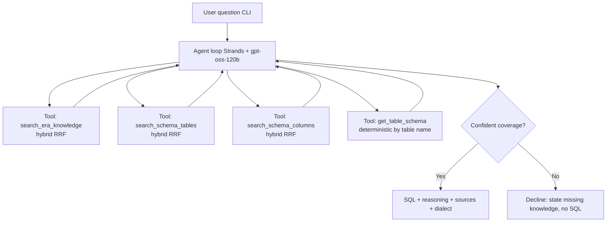

# Text-to-SQL Agent

## Problem Frame

Analysts answer ad-hoc data requests (ERA tickets) by hand-writing SQL against the
datalake. This requires knowing which tables hold a concept, the exact column
names/coded values, and the idioms used to solve similar past requests. That
knowledge already exists in two retrieval knowledge bases (see `RETRIEVAL.md`): ERA
precedents (`era_knowledge`) and the schema catalog (`schema_tables`/`schema_columns`).

We want an agent that takes a natural-language question and returns a **draft SQL
query** grounded in those two knowledge bases — so analysts get a verifiable starting
point instead of writing from scratch. The agent **does not execute** SQL; it produces
the query, its reasoning, and its sources for a human to review and run.

## User Flow

## Requirements

**Core Behavior**
- R1. Accept a natural-language question (Indonesian or English) and return a draft
  SQL query without executing it against any database.
- R2. Run as an agentic tool-calling loop: the model decides which knowledge tools to
  call and may call them multiple times to augment its understanding before answering.
- R3. Infer the target SQL dialect from the closest-matching ERA precedent's
  `query_engine` (SparkSQL or SQLServer) and state which dialect was chosen.
- R4. When the knowledge bases do not confidently cover the question, **decline**:
  return no SQL and instead state what knowledge was missing (e.g. no precedent for the
  request type, unknown table/column for a concept). Do not emit a guessed query.

**Knowledge Tools**
- R5. Provide an ERA-knowledge tool that retrieves relevant past cases and returns, per
  hit: the precedent SQL, the tables/columns involved, `key_filters`, request type,
  `query_engine`, and analyst notes — so the agent can learn table choice and SQL idioms
  from how similar cases were solved.
- R6. Provide schema-knowledge tools enabling the agent to (i) discover candidate
  tables/columns for a concept (description, data type, coded values) and (ii)
  deterministically retrieve the known column dictionary for a given table name (which
  may include `tid<N>.field` placeholders until the full catalog is loaded). Exact tool
  granularity — one combined search tool vs. separate table/column tools — is decided in
  planning.
- R7. All knowledge retrieval uses the hybrid dense+sparse RRF method documented in
  `RETRIEVAL.md` (BGE-M3 dense via the embedding service + local BM25 sparse, fused with
  RRF).

**Integration**
- R8. Drive the model (gpt-oss-120b on Bedrock) exclusively through the federated
  session in `bedrock_session.py`; no separate/standard AWS credentials path.
- R9. Use `embedding_service.py` (`embed_one`/`embed`) for all query embedding and
  `pg_config()` for the Postgres connection.
- R10. Read knowledge only, enforced at the DB privilege level — connect via a
  dedicated Postgres role with `SELECT`-only grants on the KB tables, **not** the
  default `postgres` superuser in `pg_config()`. No runtime read or write access to the
  `era_tickets` table. (Note: `era_knowledge` is a build-time-derived cleaned subset of
  `era_tickets`, so it inherits that corpus's coverage/provenance — the boundary is
  about runtime access, not data lineage.)

**Safety & Trust**
- R12. Treat all retrieved KB content (analyst notes, precedent SQL, schema text) as
  **untrusted data, not instructions**: delimit/label it in the prompt, instruct the
  model never to follow directives embedded in it, and constrain generated output to
  read-only `SELECT`-style SQL (no DDL/DML). "No execution" is a design guarantee (no DB
  execution code path exists), and drafts are presented as unverified for human review.
- R13. The trust boundary to the external Bedrock-hosted model is explicit: KB content
  (incl. analyst notes) and schema identifiers leave the bank's control when sent to the
  model. Confirm this content carries no PII / customer-identifying / confidential-
  classified data, or define redaction before it enters the model context. Do not log or
  print secrets, tokens, or full identity/role ARNs at default verbosity; keep `.env`
  gitignored.

**Output Contract**
- R11. For a SQL-producing answer, output includes: the SQL query, a short
  natural-language explanation of the approach, the tables/columns used, the ERA
  precedent ticket id(s) it drew from, and the chosen dialect. For a decline (R4),
  output is the missing-knowledge statement instead — no SQL, no dialect.

## Success Criteria
- For a question matching a known ERA case, the agent retrieves that precedent and
  produces SQL grounded in its idioms and schema-confirmed identifiers, in the
  precedent's dialect, citing the ticket id. (Runnability itself is verified by the
  human analyst out-of-band — the system cannot execute or validate, by scope.)
- The SQL references only real tables/columns confirmed via the schema KB (no
  hallucinated identifiers) for questions the KBs cover.
- For an out-of-scope question, the agent declines and names the missing knowledge
  rather than inventing a query.
- An analyst can read the reasoning + sources and verify the query without re-deriving
  it from scratch.
- **Outcome (measured on the full catalog, not the sample):** in a pilot of real ERA
  tickets, analysts accept or lightly edit the draft (rather than rewrite) for a target
  share of covered questions and report time saved vs. writing from scratch.

## Scope Boundaries
- No SQL execution, no live database introspection, no result rendering.
- No write path to any KB table; `era_tickets` (raw corpus) stays untouched.
- No new ingestion/embedding pipeline — consumes the already-built `era_knowledge` and
  `schema_*` tables as-is.
- Single-question CLI flow only; no HTTP API, auth, multi-user, or persistence in v1.
- No automatic query correctness/validation beyond grounding in the KBs.

## Key Decisions
- **Agent SDK = Strands Agents (AWS):** its `BedrockModel` accepts an existing `boto3`
  Session, so `bedrock_session.py`'s federated session integrates directly while keeping
  a standard tool-calling loop. **Contingent** on the tool-calling spike below — Strands
  consumes only the federated *credentials* (`BedrockSession.session`); the existing
  `invoke_model` body, Mantle fallback, and `_strip_reasoning` are not on its code path,
  and credential refresh (`refresh_if_needed`) must be re-wired into the agent loop.
- **Output = SQL + reasoning + sources:** maximizes analyst trust/verifiability at low
  extra cost.
- **Dialect inferred from precedent:** matches how each case was actually solved rather
  than forcing one engine. _Reviewed and confirmed_ over a user-override option — input
  simplicity is preferred; the residual wrong-engine risk is accepted for v1 and the
  output always states the chosen dialect so the analyst can catch a mismatch.
- **Hybrid retrieval from day one:** RETRIEVAL.md already verified hybrid RRF ranks the
  correct ticket #1; lexical precision matters for report codes (TL506, etc.).
- **Decline on low confidence (strict, binary):** favors trust over coverage for a
  draft-SQL assistant. _Reviewed and confirmed_ over a graded/best-effort option — for
  v1 the agent produces a confident draft or declines (naming missing knowledge); it does
  not emit caveated guesses, even when schema partially grounds the question.
- **CLI chat loop for v1:** fastest path to a usable, demoable tool; can be wrapped by a
  library/API later.

## Dependencies / Assumptions
- Postgres KB is populated and reachable (`localhost:5433`): `era_knowledge` (4233),
  `schema_tables`/`schema_columns` (200 sample), plus `*_bm25` vocab tables — verified
  present.
- `psycopg2` is **not yet installed** in the venv (only `boto3` is); the agent will need
  a Postgres driver plus the Strands SDK added.
- The BGE-M3 embedding endpoint (`EMBED_URL`) is reachable at runtime.
- Questions and precedents are largely Indonesian; the agent must handle Indonesian
  input and the Indonesian `intent_text`/`search_text` content.
- Schema KB is currently a 200-row **sample** export; some column ids are `tid<N>.field`
  placeholders until the full catalog is loaded (per RETRIEVAL.md). **Decline-threshold
  calibration and any quantitative evaluation must run against the full catalog, not the
  sample** — sample results are provisional and not a usefulness verdict (the sample will
  over-decline or ground on placeholder ids).
- The three KBs have **distinct sparse dimensions/vocabs** (`era_knowledge` 5810,
  `schema_tables` 684, `schema_columns` 698), each with its own `*_bm25`/`*_bm25_meta`
  tables; query sparse-encoding must load the matching vocab/idf/dim per KB.

## Outstanding Questions

### Resolve Before Planning
- (none — product decisions resolved)

### Deferred to Planning
- [Affects R2, R8][Needs research] **First spike, gates the architecture.** Does
  gpt-oss-120b on Bedrock support tool/function calling via the Converse API that Strands
  uses by default? Acceptance test: a Converse call with a `toolConfig` against
  `openai.gpt-oss-120b-1:0` in `ap-southeast-3` returns `stopReason = tool_use`. The
  existing `invoke_model` + Mantle fallback + `_strip_reasoning` (chain-of-thought
  output) suggest it may not be Converse-native. **Pre-decided fallback so planning is
  never blocked:** if Converse tool-use is unsupported, drive a hand-rolled tool loop
  over the existing OpenAI-style `invoke_model`/Mantle body (which carries `tools`/
  `tool_calls`), wrapped as a custom Strands model provider; prompted ReAct is the last
  resort.
- [Affects R5, R6][Technical] Final tool granularity and signatures (e.g. one schema
  tool vs. the three in R6), result sizes/limits per tool, and how much payload to feed
  back into the model context per call.
- [Affects R7][Technical] Where the shared hybrid-retrieval helper lives (reuse vs.
  extract from existing `embed_to_pg.py`/query recipes) and how BM25 vocab/idf is loaded
  per KB table.
- [Affects R4][Technical] Concrete low-confidence threshold/heuristic that triggers a
  decline. Note: RRF scores (`1/(60+rk)`) are never zero and dense search always returns
  `LIMIT` rows, so coverage cannot be inferred from result presence — gate on a raw
  signal (top-hit dense cosine and/or BM25 inner-product magnitude). Calibrate on the
  full catalog.
- [Affects R13][Needs research] Data-classification audit of the 4233 `era_knowledge`
  rows: do analyst notes / `key_filters` contain PII, customer identifiers, or
  confidential banking data before they are sent to the external Bedrock model? Confirm
  the Bedrock target role is least-privilege (single-model invoke) and the data-residency
  posture of the `ap-southeast-3` endpoint.

## Next Steps
→ `/ce:plan` for structured implementation planning
