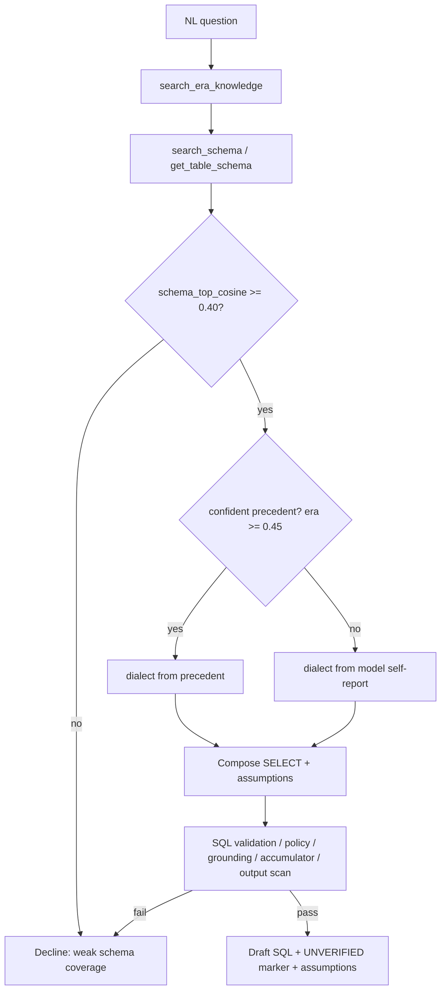

# Graded Precedent Fallback + Assumptions-First Drafting

## Problem Frame

The current agent treats a matching precedent as **mandatory**. The coverage gate
(`gates.py:coverage_ok`, consumed by `decide`) declines unless **both**
`era_top_cosine >= 0.45` **and** `schema_top_cosine >= 0.40`. So a request with no
similar past ticket is declined *even when the schema KB clearly contains the right
tables and columns*. This is stricter than the intended analyst flow: precedent should
be a head-start, not a precondition. When no precedent exists but the schema is
well-covered, the agent should still draft SQL — grounded in confirmed schema metadata
— rather than refuse.

Separately, the flow is strictly one-shot and never expresses *how* it interpreted an
ambiguous request. Analysts get SQL or a bare decline, with no visibility into the
interpretation choices the model made.

The four downstream safety gates (SQL validation, policy/denylist, grounding, and the
retrieval accumulator) already enforce correctness independently of precedent. Removing
the hard precedent floor shifts primary grounding authority onto those gates, which is
where it belongs.

## User Flow

## Requirements

**Coverage gate (graded fallback)**
- R1. The coverage gate must no longer hard-block on precedent. A missing or weak
  precedent (`era_top_cosine < 0.45`) must not, by itself, cause a decline.
- R2. The schema floor remains the bar: decline only when `schema_top_cosine < 0.40`.
- R3. Precedent is advisory. When a confident precedent exists it still informs the
  draft (and dialect, per R6); when it does not, the agent proceeds schema-first.

**Dialect resolution**
- R6. When a confident precedent exists (`era_top_cosine >= 0.45`), dialect is derived
  from the top precedent's `query_engine` (current behavior, unchanged).
- R7. When no confident precedent exists, dialect comes from the model's self-reported
  `dialect` field, and SQL validation runs under that dialect.

**Assumptions surfacing**
- R8. The result contract gains an explicit `assumptions` field. When the model makes
  an interpretation choice (e.g. the meaning of "active", a time window, a segment), it
  states those assumptions plainly for the analyst to verify.
- R9. The agent does not ask the user follow-up questions. It picks the most reasonable
  interpretation, records its assumptions (R8), and emits a draft. The flow stays
  one-shot.

**Output marking**
- R10. Schema-first drafts carry the **standard** `UNVERIFIED_DRAFT` marker — no
  separate "no precedent" warning. The advisory nature of precedent is conveyed via an
  empty `precedent_ids` list and the explanation/assumptions text.

**Prompt + safety continuity**
- R11. The system prompt must describe the schema-first path: if no similar precedent is
  found, confirm tables/columns via `search_schema`/`get_table_schema` and draft from
  those; self-report the dialect when no precedent anchors it; populate `assumptions`.
- R12. All other gates are unchanged and apply identically in the schema-first path:
  single read-only SELECT validation, table denylist + PII column policy, schema-KB
  grounding, the retrieval accumulator (every referenced table must have been fetched
  via a tool this session), and the destructive-keyword output scan.

## Success Criteria
- A request with strong schema coverage but no precedent produces a gated draft SQL
  instead of a `coverage` decline.
- A request with weak schema coverage (`< 0.40`) still declines.
- In the schema-first path, the SQL-validation, policy, grounding, accumulator, and
  output-scan gates all still fire and can still decline an unsafe/ungrounded draft.
- Every draft that involved an interpretation choice carries explicit assumptions.
- No interactive prompts are introduced; `generate_sql` remains a single call.
- Existing precedent-backed requests behave exactly as before (dialect from precedent,
  precedent_ids populated).

## Scope Boundaries
- No interactive, multi-turn clarification — the agent never blocks waiting on a user
  answer.
- No relaxation of the SQL-safety, policy/denylist, grounding, or accumulator gates.
- No separate "higher-risk / no-precedent" output marker; standard UNVERIFIED marker only.
- No dialect inference from the schema KB (it carries none); no defaulting to a fixed
  dialect.
- No changes to retrieval, embeddings, or the knowledge-base contents.

## Key Decisions
- **Precedent advisory, schema floor authoritative**: chosen over a raised schema floor
  or a permissive-everywhere stance — keeps the 0.40 bar that already protects against
  guessed identifiers while letting strong schema coverage stand on its own.
- **Trust model self-report for dialect when no precedent**: chosen over dialect-agnostic
  labeling; accepted that the model is guessing, mitigated by the dialect-independent
  structural rejection in `validate_sql`.
- **Assumptions-only, no questions**: chosen over an interactive loop or a structured
  "needs clarification" result — preserves the one-shot architecture and avoids REPL
  state changes while still giving the analyst the interpretation context they need.
- **Grounding/accumulator gates become the primary safety net** in the schema-first
  path, replacing the precedent floor as the anti-hallucination mechanism.

## Dependencies / Assumptions
- The retrieval accumulator and grounding gates are assumed strong enough to catch
  hallucinated identifiers without the precedent floor. (This is the core safety bet of
  the change.)
- `validate_sql` already performs dialect-independent DDL/DML rejection and falls back to
  Spark parsing, so a wrong self-reported dialect cannot turn an unsafe statement into a
  passing one — only affect dialect-specific shown output.

## Outstanding Questions

### Deferred to Planning
- [Affects R1/R2][Technical] Should `coverage_ok` keep the `era_floor` parameter (unused
  for blocking) for logging/telemetry, or drop it entirely? Affects `decide` signature
  and `tests/test_gates.py`.
- [Affects R8][Technical] Is `assumptions` a list of strings or a single string in
  `Text2SQLResult` and the prompt JSON schema, and how does `cli.py` render it?
- [Affects R8] Should a draft with zero interpretation choices emit an empty
  `assumptions` list, or omit the field? (Product-leaning, but low-stakes; can be decided
  in planning.)
- [Affects R12][Needs research] Confirm there is no hidden code path that reads
  `era_top_cosine` as a precondition outside `coverage_ok` (grep for callers before
  changing the gate).

## Next Steps
→ /ce:plan for structured implementation planning
