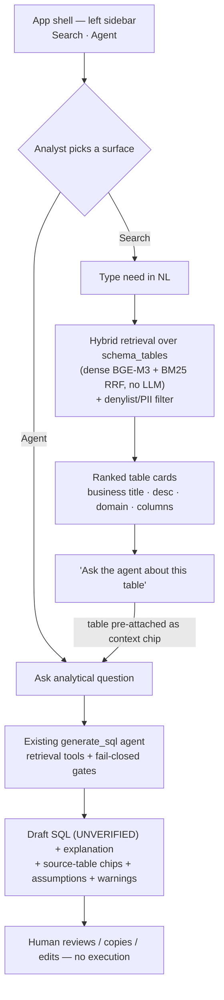

# BRISA Prototype — Data Search Engine + AI Data Agent

## Problem Frame

The existing `text2sql/` package is a single-session CLI (plus a stdlib `web.py` chat page)
that proves out retrieval + a draft-SQL agent. To make the BRISA proposal credible to BRI
stakeholders, we need a **prototype web platform** that presents two of the proposal's three
layers as polished, analyst-facing product surfaces:

- **Lapisan 2 — Data Search Engine:** "Google for BRI data." An analyst types a need in
  natural language and gets ranked **tables** with business metadata and columns — so they
  stop asking colleagues and screening schemas by hand.
- **Lapisan 3 — AI Data Agent:** an analytical chat that returns a **draft SQL query**
  (never executed) with explanation, source tables, assumptions, and safety warnings.

The core logic already exists and is reused. What's new is a **React/Next.js + FastAPI**
platform, a **search surface that is pure semantic retrieval (no LLM layer)**, and a UI
designed so the system's never-execute, fail-closed nature reads as a *feature*, not a
limitation. Lapisan 1 (metadata generation) is out of scope; embeddings in Postgres are used
as-is and never modified. **Note:** because Lapisan 1 is excluded, the quality of the search
demo is bounded by whatever business metadata already exists in the KB — the plan's first
step is to inspect it (see Resolve Before Planning).

## User Flow

## Requirements

**Platform & Architecture**
- R1. A new prototype app is created **separate from** `text2sql/web.py`: a **Next.js/React**
  frontend and a **FastAPI** backend. The backend wraps the existing `text2sql` logic; the
  CLI and existing modules keep working.
- R2. The backend exposes two explicit endpoints — a **search** endpoint (semantic retrieval)
  and an **agent chat** endpoint (draft SQL). Because Search and Agent are distinct UI
  surfaces the user chooses directly, **the FastAPI backend does not invoke the LLM intent
  router (`orchestrator.py`)** — each endpoint calls its logic directly. (See the mis-picked-
  surface escape hatch in R17/R30.)
- R3. **No SQL is ever executed**, and **no Postgres embeddings/tables are modified**. The
  backend uses the existing read-only DB role and reuses `retrieval.py`, `agent.py`,
  `gates.py`, and PII redaction. Where existing functions do not expose what a surface needs,
  the wrapper adds **additive, backward-compatible** code (it does not fork agent behavior);
  requirements that need this are called out individually below.
- R25. **AuthN/AuthZ:** both endpoints and the web UI require an authenticated bank-analyst
  identity (reuse the existing Entra ID / OIDC identity or an equivalent SSO gate);
  unauthenticated requests are rejected. Even for the demo, the app is **not exposed
  publicly** — it sits behind the corporate identity boundary (or, as an interim control, a
  locked-down demo host; state which).
- R26. **Abuse/audit controls:** both endpoints reuse the existing `audit_log` to record
  request identity + query; enforce a request-body/prompt **size cap** (carry forward
  `web.py`'s 64 KB cap); and apply basic **per-user rate limiting** on the agent-chat endpoint
  to bound Bedrock cost. If any of these is deferred for the prototype, state it as an
  accepted interim risk.

**Data Search Engine (Lapisan 2)**
- R4. Search is **pure semantic retrieval, no LLM generation**: reuse `hybrid_search`
  (dense BGE-M3 + sparse BM25, RRF-fused) over `schema_tables` for **ranking only**. A new
  **result-hydration layer** joins each ranked id to its display fields (table name,
  description, `domain_tags`, and the column dictionary from `schema_tables.columns_dict` /
  `schema_columns`) — `hybrid_search` and the prose `SearchResult` model are *not* reused for
  card shape. (This surface replaces the RAG `search_agent.py` prose behavior; see the
  capability-trade note under Outstanding Questions.)
- R4a. **The search endpoint enforces the same policy controls as the agent path**: it filters
  out any `TABLE_DENYLIST` table (incl. the raw ERA corpus) and runs `redact_note` over all
  free-text (descriptions, column notes) **before** serializing to the client. Raw
  cosine/RRF scores are stripped at the API boundary (per R6). The denylist/PII gate must not
  be an agent-only concern.
- R5. Results are a **single-column, full-width ranked list of table cards**. Collapsed cards
  show, in this hierarchy: a **headline** — the table-level business title if present,
  otherwise a **humanized `table_name`** (never empty hero text) — with `schema.table_name` as
  a smaller monospace subtitle; a **badge row** (domain from `domain_tags`; PII/sensitive and
  certified only when a real signal backs them — see R5a); and a 1–2 line description.
- R5a. **Badge honesty:** the PII/sensitive badge is driven by an explicit signal
  (`gates.RESTRICTED_FRAGMENTS` heuristic at minimum, for consistency with the agent).
  **Absence of a PII badge must never read as "not sensitive"** — where classification is
  unavailable, show a neutral "sensitivity not classified" state rather than a bare/absent
  badge.
- R6. **Do not display a numeric match/relevance score.** Rank order is the trust signal.
  Where feasible, show a **"matched on: …"** line (e.g. a matched column or term) to explain
  *why* a table ranked. A coarse 2-tier "Strong/Related" label is a P2 fallback.
- R7. Each card has an **expandable in-card column dictionary** ("Show columns (N)"), sourced
  from `schema_tables.columns_dict` or `schema_columns` (field · type · business description ·
  PII flag), keeping the analyst in the result list rather than a modal.
- R8. A **left-rail facet panel** filters results, primary facet = **business domain**, backed
  by the existing **`schema_tables.domain_tags text[]`** (GIN-indexed; e.g.
  `WHERE 'PINJAMAN' = ANY(domain_tags)`). For the prototype, **single-select** domain filtering
  with a persistent applied-filter chip bar (per-chip "×" + "Clear all") is the P0 bar;
  per-value counts, multi-select, and hide-zero-result values are **P2** polish.
- R9. **Empty/zero states never dead-end** using only signals that exist in a cold session:
  pre-search shows **browse-by-domain** (from `domain_tags`); zero-result shows reformulation
  hints, **"closest related tables"** (threshold-relaxed retrieval), and detects when a
  *filter* (not the query) caused emptiness. *(Persistence-dependent items — "recent searches",
  "most-used tables" — are out of scope for the prototype; see Scope Boundaries.)*

**AI Data Agent (Lapisan 3)**
- R10. The agent reuses the **existing `generate_sql` behavior** — the same retrieval tools,
  fail-closed gates, PII redaction, warn-don't-block warnings, and `UNVERIFIED_DRAFT` marker.
  The prototype does not change *how the agent reasons or drafts*; it **does** add a
  presentation-serving payload extension (R13a) and, for R17, an additive retrieval seam.
- R11. The agent is a **dedicated full-width surface** (not a docked chat rail), with a
  structured response in fixed regions: **interpretation** (rendered from the existing
  `explanation` field — there is no separate interpretation field) → **assumptions** (existing
  `assumptions` list) → **source tables** → **warnings** → **SQL draft**.
- R12. The **SQL block** is syntax-highlighted, expanded, **read-only by default**, carries an
  **`UNVERIFIED DRAFT` badge on the block header**, and offers **Copy** and **Edit** only —
  **no Run button**. Microcopy states the action ("Copy into your SQL editor to run").
- R13. **Source-table provenance is shown as chips** reflecting grounding: only tables actually
  retrieved/grounded get a solid chip; a table named-but-not-retrieved is flagged; no chip is
  rendered for a table absent from the schema KB.
- R13a. R13 and R15 require a **new derived payload** (they are not in today's output): a
  per-table status list `{name, in_kb, retrieved}` computed in `apply_gates` from
  `decision.referenced_tables`, `ctx.retrieved_tables`, and `known_tables`, plus the
  `era_top_cosine` / `schema_top_cosine` signals — surfaced via an extended
  `result_to_payload`. The frontend must **not** string-parse warning messages.
- R14. The **assumptions** the agent already produces are shown in a prominent panel, visually
  distinct from grounded facts.
- R15. **Confidence is never a numeric percentage.** Instead surface a coarse
  **grounding-strength label** derived from the retrieval thresholds in `gates.py`, consistent
  with its precedent-advisory / schema-first design: "Grounded in precedent (strong)" when ERA
  cosine ≥ 0.45; otherwise "Schema-only — verify carefully" when schema cosine ≥ 0.40. The
  label comes from retrieval, not model self-opinion.
- R27. **Interaction states** are specified for both surfaces (not just the happy path):
  - *Search:* skeleton card placeholders during retrieval; a dimmed "recomputing" state on the
    result list/facets while a filter applies.
  - *Agent generating:* progressive region reveal or a staged status indicator
    ("Retrieving schema… / Checking precedents… / Drafting SQL…").
  - *Agent no-SQL outcomes:* a **gate-decline** state (SQL region collapses; decline reason +
    warnings surface prominently) and a **backend/network error** state (Bedrock OIDC,
    timeout, embedding endpoint) with a retry affordance, distinct from a decline.

**Cross-Surface Integration**
- R16. **Left sidebar** with **Search** and **Agent** as co-equal destinations.
- R17. Every table card has an **"Ask the agent about this table"** action that opens the Agent
  with that table **pre-attached as a visible, removable context chip** plus an editable
  starter prompt. Interaction rules: multiple tables may be attached (they stack); removing a
  chip leaves the prompt as-is; submit is allowed with a chip-only context. **The attached
  table name is untrusted client input** — the server re-resolves it against the schema KB and
  denylist before it can influence grounding (see R17a and Resolve Before Planning).
- R17a. Making an attached table count as "retrieved" for the grounding accumulator requires an
  **additive retrieval seam** (e.g. the backend runs `get_table_schema` for each confirmed
  attached table *through the real retrieval path* before the agent loop, so it legitimately
  enters `retrieved_tables`). Injecting a client-supplied name straight into `retrieved_tables`
  is **prohibited** — it would bypass the evidence the accumulator gate exists to enforce.
- R18. **Bidirectional links (P2):** in agent output, cited table names link back to their
  catalog card. *(Precedent-ID → precedent-detail pages and carrying the domain filter across
  the handoff are deferred — they imply surfaces/state the one-way demo flow does not exercise.)*
- R30. **Mis-picked-surface escape hatch:** since there is no LLM router (R2), a zero-result
  search offers "Did you mean to ask the Agent?" and the Agent's empty state points back to
  Search — so an intent typed into the wrong surface is not a dead end.

**UI/UX & Visual Design**
- R19. Bilingual (Indonesian/English) UI copy; explanation/interpretation text localizes to
  Bahasa Indonesia while SQL and physical table/column names stay English. Layout must absorb
  ~30–40% EN→ID text expansion: primary controls use flexible width with wrapping (no
  fixed-width buttons/tabs/labels, no truncation of key labels); card headlines may break to
  two lines.
- R20. Aesthetic direction: **Next.js + Tailwind + shadcn/ui, rethemed off the defaults**
  (avoid the generic "AI slop" look). "Dense but calm" dashboard: 8pt spacing grid, sidebar +
  main content, cards only where the card is the interaction.
- R21. Typography and numerics as trust signals: an institutionally credible family (e.g.
  IBM Plex Sans + IBM Plex Mono for SQL), **tabular figures** on numeric columns.
- R22. Restrained color: neutral surface + a single blue/teal trust accent. A **distinct amber
  warning treatment** for the `UNVERIFIED_DRAFT` / warnings state that can never be confused
  with a validated query. Semantic colors (success/warning/error) must not double as the brand
  accent. **Avoid green as a hero/brand color** (Indonesian cultural connotation); green only
  as a small functional success tick.
- R28. **Responsive & accessibility baseline:** the prototype targets **desktop at a stated
  minimum width** (e.g. ≥1024px) with a graceful below-min message — full responsive reflow of
  the sidebar + facet rail is out of scope. Accessibility: keyboard operability (search submit,
  facet toggles, filter-chip removal, the column-dictionary disclosure with `aria-expanded`),
  screen-reader-exposed text for the read-only SQL block, and a **redundant non-color cue**
  (icon + label) for the `UNVERIFIED_DRAFT` / warning state so it never relies on amber alone.
  Target WCAG 2.1 AA for the core flows.

**Trust & Safety Framing**
- R23. A **specific, in-context, action-oriented caveat** sits next to the SQL block
  ("Unverified draft — not executed; review tables, joins, and filters before running"), not a
  generic footer banner. Stated once, clearly: the assistant drafts SQL only and cannot access,
  run, or return data.
- R24. **Ambiguity handling is one-shot, not conversational.** The current agent prompt
  forbids follow-up questions ("pick the most reasonable interpretation and record it in
  `assumptions`"), so on ambiguous input the surface leans on **prominent, editable
  assumptions** (R14) that the analyst corrects and re-submits — it does **not** return a
  clarifying question. A true clarify-back loop would be **new agent logic** (prompt +
  `Text2SQLResult` change) and is out of scope for the prototype.

## Success Criteria
- **Scripted-flow credibility (measurable):** a fixed set of ~10–15 representative
  Indonesian/English analyst questions (drawn from the existing analyst survey), curated to
  tables that have real metadata, runs end-to-end in the demo. Bar: the target table appears in
  the search **top-5 for ≥80%** of them (matching the parent proposal KPI), and each produces a
  clearly-draft SQL artifact with visible source tables, assumptions, and warnings.
- An analyst can, in one session: search a need in NL → get relevant ranked tables with
  business context → open the agent pre-scoped to a chosen table → receive a clearly-draft SQL
  query — **without any query executing**.
- The search surface returns ranked tables with **no LLM call**, **no Postgres writes**, and
  **no denylisted/PII leakage** (R4a), reusing existing embeddings.
- The agent surface reproduces the existing `generate_sql` drafting faithfully, with the
  never-execute / fail-closed nature visible in the UI (draft badge, no Run, grounded chips).
- The prototype passes the `frontend-design` litmus checks (not "enterprise-ugly," not generic
  AI slop).

## Scope Boundaries
- **Lapisan 1 (automated metadata generation)** is out of scope. Metadata/embeddings are
  consumed as-is; nothing is generated or re-embedded.
- **No SQL execution** and **no data-row return**, ever — drafts only.
- **No changes to Postgres** contents, embeddings, or schema; read-only role only.
- The `orchestrator.py` intent router is **not** invoked by the new platform (surfaces are
  explicit). The CLI and `text2sql/web.py` remain but are not the deliverable.
- **No persistence layer:** no per-user history/telemetry — so "recent searches", "most-used
  tables", and a session-crossing **History** destination are excluded from the prototype.
- Multi-turn conversational memory and a clarify-back loop (R24) beyond what `generate_sql`
  already does are **not** added.
- **Example SQL from precedents on search cards is excluded** (decided): search cards stay
  metadata-only; the **"Ask the agent about this table" cross-link (R17) is the path** to see
  how a table is queried. Precedent SQL remains an agent-side concern.

## Key Decisions
- **New React/Next.js + FastAPI platform, not an extension of `web.py`** — the proposal's
  stated stack and the only way to hit the "best UI" bar; the polished demo is the point.
- **Search = pure semantic retrieval, no LLM** — reuse `hybrid_search` for ranking; drop the
  RAG prose layer. Fast, cheap, deterministic. (Trade: loses the prose existence/structure
  Q&A the old `search_agent` gave — see Outstanding Questions.)
- **Explicit surfaces, no LLM router** — the user chooses Search vs Agent; a lightweight escape
  hatch (R30) absorbs a mis-picked surface.
- **No numeric scores anywhere** (search relevance or agent confidence) — replaced by *why*
  signals: "matched on: field" for search, retrieval-derived grounding-strength for the agent.
  Backed by data-catalog conventions (Amundsen/DataHub/Atlan/Collibra) and HCI trust research
  (Google PAIR, Microsoft HAX).
- **The never-execute design is the hero** — no Run button, on-artifact draft badge,
  confirmable grounded-table chips, editable assumptions turn existing gates into visible
  user-facing trust artifacts.
- **Table→Agent cross-link with a context chip** — highest-leverage connective feature.
  Making the attached table count as grounded requires an **additive retrieval seam** (R17a),
  not a gate bypass; the exact mechanism is resolved before planning.
- **Reuse policy controls on the search surface (R4a)** — denylist + PII redaction are not
  agent-only; the search endpoint applies them too.

## Dependencies / Assumptions
- **The domain facet (R8) has a real backing column.** Per `RETRIEVAL.md`,
  `schema_tables` includes `domain_tags text[]` (GIN-indexed, derived from descriptions),
  `column_names[]`, and `columns_dict` — the current `tools.py` code only *SELECTs* `id,
  table_name, table_description`, which is what earlier framing mistook for the whole schema.
  Confirm `domain_tags` is **populated** in the live KB (first planning step).
- **Metadata quality is thin and bounds the demo.** The sample source
  (`approved_mage_tables.json`) shows many `table_business_title: null` and `[AI]`-boilerplate
  descriptions. Table-level business title may be absent → R5's headline falls back to a
  humanized `table_name`. The demo dataset must be **curated to tables with real metadata**.
- **PII/sensitivity signal** is likely only the `gates.RESTRICTED_FRAGMENTS` keyword heuristic
  (real column-level PII classification is not available) — R5a renders honestly around that.
- The existing read-only role, BGE-M3 embedding endpoint, and Bedrock OIDC chain are available
  to the FastAPI backend exactly as they are to the CLI; the backend should own a **shared**
  BedrockSession + read-only connection and pass them via `session=`/`conn=` to avoid
  per-request OIDC/connection cost.

## Outstanding Questions

### Resolve Before Planning
- [Affects R5/R7/R8][Needs research][User+Technical] **Inspect the live KB first.** Confirm how
  many `schema_tables` rows have (a) populated `domain_tags`, (b) a non-null business title,
  (c) rich vs boilerplate descriptions, and (d) any PII/certification signal. The answer sets
  the realistic card/facet shape and the curated demo dataset. *(Product shape is settled
  **contingent** on this — it is not open-ended design, but it must be verified before build.)*
- [Affects R17/R17a][Technical→decision] **Confirm the attached-table grounding seam:** run
  `get_table_schema` through the real retrieval path for each confirmed table (recommended), vs
  treat the chip as a prompt hint only (no grounding). This is load-bearing for R13 and must
  not weaken the accumulator gate.

### Deferred to Planning
- [Affects R4a][Technical] Confirm whether the read-only role `t2s_ro` already excludes
  denylisted/raw-corpus rows at the DB layer (which would harden R4a for free).
- [Affects R11–R15][Technical] The extended `Text2SQLResult` → JSON payload shape (per-table
  grounding status + cosine signals per R13a), and how streaming/thinking-steps are surfaced.
- [Affects R19][Technical] Bilingual copy / i18n approach and which strings localize vs stay
  English.
- [Affects R20][Needs research] shadcn retheme tokens (type scale, radius, color) to hit the
  BRI-credible-but-modern look during the `frontend-design` build.

## Next Steps
→ `/ce:plan` for structured implementation planning. Plan must **open by inspecting the live
`schema_tables`/`schema_columns` data** (domain_tags, business-title, PII coverage) and curate
the demo dataset, then sequence: FastAPI wrapper endpoints (with auth + denylist/PII on search)
→ search surface → agent surface (payload extension) → cross-link (grounding seam) → visual
polish via the `frontend-design` skill.
