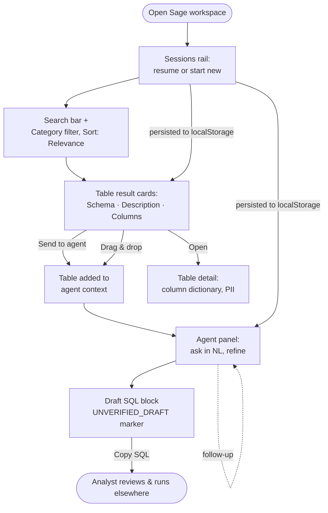

# Sage — Redesign & Rebrand of the BRISA Search + Agent Console

## Problem Frame

The internal search-and-draft-SQL console (currently "BRISA") is getting a full visual
and interaction redesign, captured as a design mock in `Sage.html`. The redesign renames
the product to **Sage**, replaces the cool slate/teal institutional look with a warm
cream + terracotta theme, swaps the typography, and — most significantly — reorganizes the
flow from two separate pages (`/search`, `/agent`) into a **single unified workspace** with
a Sessions history rail and drag-and-drop of tables into agent context.

The audience is unchanged: internal BRI data analysts on desktop. The core value
proposition is unchanged too: **draft SQL is never executed** — the human analyst reviews
every draft before running it elsewhere. This redesign is about presentation and flow, not
about changing what the system is allowed to do.

## User Flow

## Requirements

**Branding & Identity**
- R1. Rename the product to **Sage** in all user-facing surfaces (page title/metadata,
  sidebar/header, empty states, below-min notice). Tagline: *"BigData search & generation"*.
  The rename surface is larger than cosmetic: "BRISA" appears ~79 times across ~28 files,
  including the **FastAPI app title, log tags, and environment-variable names**
  (`BRISA_API_TOKEN`, `BRISA_FRONTEND_ORIGIN`). Env-var renames are config-breaking (deploy
  configs, `.env`, secrets), so treat them as a deliberate decision (see Deferred to Planning),
  not an opportunistic sweep.
- R2. Adopt the Sage typography: **Instrument Sans** (weights 400/500/600) for UI, **JetBrains
  Mono** for code/SQL/physical names — replacing IBM Plex Sans/Mono.
- R3. Adopt the Sage default theme tokens: warm cream canvas (`--bg #EAE6D9`), surfaces
  (`--pane #F5F1E7`, `--surface #FBF9F3`, `--card #FFFDF8`), **terracotta accent
  `#C96442`**, blue links `#2F5AE0`, and the warm taupe neutral/divider/chip scale. This
  replaces the current slate + teal token set. The unverified-draft state keeps a distinct
  warning treatment so it can never read as a validated query.
- R4. Update the favicon/app icon to the Sage mark (terracotta rounded square + search-glyph
  from `Sage.html`).

**Unified Workspace Layout**
- R5. Replace the two-page structure (`/search`, `/agent`) with a **single unified workspace**
  matching the Sage mock: a left rail (Sessions + Category), a search + results area, and an
  agent panel, visible together.
- R6. Provide a **Sessions rail** listing prior searches/chats in the workspace, with the
  ability to resume a session or start a new one.

**Search Experience**
- R7. Keep semantic table search with a **Category** facet (current "domain" filter) and a
  **Sort: Relevance** control.
- R8. Render result cards in the Sage card style showing table **Schema, Description, and
  Columns** (where "Columns" is the column *count* from `n_columns`, not a name list). (See
  Key Decisions re: the design's "Rows" field.)
- R9. Each result card offers **Send to agent** (adds the table to agent context) and opens a
  table detail view (column dictionary + PII badges) as today.

**Agent Experience**
- R10. Keep the conversational draft-SQL agent (ask in natural language, refine with
  follow-ups), restyled to the Sage agent panel.
- R11. Support **drag-and-drop of table cards into the agent context** ("Drop tables to add
  context") in addition to the Send-to-agent button, with a visible drop target. Define the
  full interaction: a card grab affordance, a drop-zone highlight on drag-start, valid-hover
  vs. neutral-hover, drop-success confirmation (attached table animates into the context
  list), and the **already-attached / over-cap** response (the backend caps attached tables
  at 10 and dedups; the client must reflect both). Provide a **keyboard-accessible path** (the
  Send-to-agent button + a focus-visible confirmation) that reaches the same drop-success
  feedback.
- R12. Show **"Try asking"** starter prompts in the empty agent state.
- R13. Render the draft SQL in the Sage SQL block. The mock already contains a **Copy**
  affordance — keep it as the primary action (**"Copy SQL"**). The mock's separate **"Run"
  control and results-table apparatus are removed, not relabeled**: do not add a "Run" control
  or a disabled "coming soon" button (a coming-soon execute control would imply execution is
  planned, contradicting R16). Specify what fills the agent-panel space the removed results
  table vacates so the layout reflows cleanly. SQL is **never executed** from Sage.

**Interaction States**
- R18. Define the non-happy-path states for both panes so implementers don't invent them
  per-surface: **search** — initial empty, loading/skeleton, zero-results (distinct from
  initial, with a suggested action), and API-error/retry; **agent** — empty ("Try asking"),
  generating/loading, complete, network error, and the **gate-decline** state. R16 guarantees
  declines occur, so the decline UI is a first-class state with its own copy and treatment —
  it must read as an intentional safety hold, not a generic error.

**Sessions & Persistence**
- R14. Persist Sessions and their contents (searches, chats, attached tables) to **browser
  localStorage** so history survives a page refresh. No server-side/DB persistence. Note this
  is a **state-model change**, not just a serialization add-on: the current `AppState` holds a
  single active search + single agent conversation, whereas Sessions require a keyed collection
  of sessions plus an active-session pointer, hydration on load, and handling of non-persistable
  in-flight fields (e.g. the `sending` flag). Define a **quota/eviction policy** — each session
  embeds full `AgentResponse` objects and localStorage caps near ~5 MB, so specify a max-retained
  count and pruning of oldest sessions.
- R19. **localStorage data-at-rest safety.** Session contents can include BRI banking
  schema/column names and PII-adjacent metadata, and localStorage is unencrypted plaintext
  readable by any script (incl. via XSS) or by local-profile access on a shared analyst
  desktop. Specify: (a) what may/may not be persisted (e.g. exclude PII-flagged column detail
  and redacted-note content; persist table identifiers/queries, not full sensitive payloads);
  (b) a **"Clear history" control** and a retention/TTL rule; (c) an explicit, recorded
  acknowledgement that localStorage is the accepted store and why. This risk exists because
  R14 introduces client-side persistence the current in-memory app never had.

**Language**
- R15. UI copy is **bilingual**: Indonesian primary with English secondary labels (extending
  the current sidebar label/sub-label pattern). The agent continues to accept both Indonesian
  and English questions regardless of UI language. **Scope the ID/EN stacking to navigation and
  section-level labels only**; use single-language (Indonesian-primary) for high-frequency dense
  content — result-card fields, facet options, column-dictionary rows, and SQL — where doubling
  every line would break the crowded single-screen layout.

**Safety Posture (unchanged — non-negotiable)**
- R16. The **draft-only** posture is preserved end to end: all `gates.py` checks, the
  read-only DB role, the denylist, and the `UNVERIFIED_DRAFT` marker remain exactly as they
  are. Nothing in this redesign adds a path that executes SQL against the database.

**Cleanup**
- R17. Delete superseded/dead code and stray artifacts, confirming each before removal:
  legacy `text2sql/web.py` (+ `tests/test_web.py` — verified: `web.py` is imported only by that
  test, not by live `api.py`), root-level `note.md`, and the survey `.xlsx`. **Do not delete
  `Sage.html`** — it is the sole source of design tokens/fonts/spacing, is currently untracked
  in git, and its extraction is a lossy interpretation of a bundled artifact. Instead **archive
  it** (commit it to a versioned design-assets location, or extract its decoded blobs to a
  versioned reference) so it can be re-consulted if extraction gaps surface later. Other
  non-source clutter surfaced during implementation is included pending confirmation.

## Success Criteria

- A returning analyst immediately recognizes the app as "Sage" — warm cream/terracotta theme,
  Instrument Sans + JetBrains Mono, no residual "BRISA" or slate/teal in user-facing surfaces.
- Search, attach-to-agent (button **and** drag-drop), draft-SQL, and follow-up refinement all
  work in one screen without navigating between pages.
- Reopening the app after a refresh restores the Sessions list and lets the analyst resume a
  prior search/chat.
- No affordance anywhere executes SQL; the draft-only guarantees (gates, read-only role,
  UNVERIFIED_DRAFT marker) are provably intact (existing gate tests still green).
- The dead-code/artifact list is removed with no broken imports or failing tests.

## Scope Boundaries

- **No SQL execution.** No query runner, no live "Rows"/results table, no change to the
  safety gates or DB role. The mock's Run control + results table are **removed**; Copy stays.
- **No server-side sessions.** Persistence is localStorage only; the FastAPI surface stays
  stateless.
- **API contract preserved.** The existing endpoints (`/api/search`, `/api/search/columns`,
  `/api/search/table`, `/api/search/domains`, `/api/agent/chat`) and their payloads are kept;
  the backend **request flow** is unchanged. Backend work is rebranding + cleanup — but note
  "rebranding" is not purely cosmetic here: it includes config-breaking env-var renames and the
  app title/log tags (see R1), not just docstrings.
- **Single default theme only.** `Sage.html` defines several alternate accent themes (green,
  blue, pink, gold, purple); only the default terracotta theme is in scope. No user-facing
  theme switcher unless explicitly requested later.
- **Desktop-only** remains (the below-min notice stays).

## Key Decisions

- **Draft-only kept; execution UI removed** (R13, R16): the decoded mock is built *around*
  executing SQL — a Run click-handler plus a live results table — sitting **alongside** an
  existing Copy button. Because the system forbids execution, the Run + results-table apparatus
  is **removed** and Copy stays as the primary action. Run is not relabeled to Copy (that would
  duplicate the existing button), and no "coming soon" execute control is shown. Planning must
  account for the agent-panel space the results table vacates.
- **Full unified workspace** (R5): adopt the Sage single-screen flow rather than restyling the
  two existing pages, because the Sessions rail + side-by-side agent is central to the design.
- **Drag-and-drop context** (R11): implement the design's drop-to-attach interaction, keeping
  the button handoff as an accessible fallback.
- **localStorage sessions** (R14): gives durable history with zero *backend* cost, but it is
  not "zero cost" on the client — it requires restructuring `AppState` into a session collection
  and a quota/eviction policy (see R14).
- **Full scope confirmed for v1** (R5, R11, R14): review flagged that durable persistence,
  drag-and-drop, and the full re-architecture are three net-new capabilities riding on a reskin
  and could be split into a leaner milestone. Decision: **keep all three in the first
  milestone** — the unified workspace, drag-and-drop, and localStorage persistence ship
  together. The client-side cost (state-model rework, DnD, R19 persistence safety) is accepted.
- **Bilingual copy** (R15): honor the current Indonesian-first product while surfacing the
  design's English labels as secondary.
- **"Rows" field dropped/deferred** (R8): the `schema_tables` catalog stores `n_columns` but
  **no row count**, and draft-only means we never query production to count rows — so the
  design's "Rows" cannot be truthfully populated. Recommend dropping it (or showing column
  count only). Final call deferred to planning pending a catalog check.
- **Pragmatic rename depth** (R1): user-facing strings and code identifiers rename to Sage;
  internal docstring/comment mentions of "BRISA" (~79 occurrences across ~28 files) are updated
  opportunistically. **Exception:** env-var names, the FastAPI app title, and log tags are *not*
  opportunistic — env-var renames are config-breaking and get an explicit decision (Outstanding
  Questions), not a silent sweep.

## Dependencies / Assumptions

- Design extraction from `Sage.html` is a **verification task, not a settled assumption**.
  `Sage.html` is a gzip-bundled runtime artifact whose markup uses a bespoke template dialect
  (`sc-for`, `sc-if`, `{{ }}` bindings) that must be **re-authored** into React/Tailwind, not
  copied — a lossy interpretation step. Acceptance criteria before relying on it: all tokens
  captured; woff2 files **validated to render Indonesian diacritics** (required by R15's
  bilingual copy); spacing/layout confirmed against a rendered screenshot diff. Do not delete
  `Sage.html` on "extraction happened" — gate on that sign-off (R17).
- Instrument Sans + JetBrains Mono sourcing is a **blocking go/no-go check**: `next/font/google`
  only exposes fonts Google hosts, and this is a non-standard Next.js 16 build (see
  `frontend/AGENTS.md`). If the named import isn't available, the fallback is self-hosting the
  woff2 from the bundle via `next/font/local` — a materially different implementation. Confirm
  before committing R2 to a path.
- The full-workspace rewrite (R5) **breaks the `.design-sync` bundle contract**:
  `frontend/.ds-entry.tsx` re-exports `Sidebar`, `SqlBlock`, `TableCard`, and `AppStateProvider`,
  and cached grade artifacts are keyed to those component files. Dissolving `Sidebar` into a
  Sessions+Category rail will orphan those references — `.design-sync` reuse is optional, but
  the rewrite must decide what happens to `.ds-entry.tsx`.
- The current frontend has more than two routes: `app/page.tsx` (`/` → redirect to `/search`)
  and `app/table/[id]/page.tsx` (table detail). Collapsing to one workspace must decide the
  fate of the `/` redirect and whether `/table/[id]` stays a route or becomes an inline panel —
  which in turn affects the session-persistence design.
- Frontend stack is unchanged: Next.js 16 (App Router), React 19, Tailwind v4, TypeScript.

## Outstanding Questions

### Resolve Before Planning
- _(none — all blocking product decisions resolved.)_

- [Affects R8][Technical] Confirm no row-count is available anywhere in the KB catalog
  (feasibility review verified `schema_tables` selects only `n_columns`; no row-count column
  found repo-wide). Finalize dropping "Rows" vs. relabeling to column count.
- [Affects R5, R6][Design] Define the single-workspace layout model: how the panes size/scroll
  at ≥900px, whether selecting a Session swaps only search+results or the whole workspace
  (agent conversation + attached tables too), and **where table detail renders** (modal vs.
  right-side slide-over vs. inline) given it competes for space with the agent panel and must
  stay reachable during drag-to-attach.
- [Affects R14][Technical] localStorage retention/eviction policy: max sessions retained,
  pruning strategy, and serialized size of accumulated `AgentResponse` history vs. the ~5 MB
  quota.
- [Affects R11][Technical] Drag-and-drop mechanism (HTML5 DnD vs. a library — none is in
  `package.json` today) and the accessibility-fallback wiring.
- [Affects R2][Needs research] Confirm Instrument Sans / JetBrains Mono sourcing (next/font
  vs. self-hosting the woff2 from the bundle), woff2 diacritic coverage, and licensing.
- [Affects R1][User decision] Env-var rename: keep `BRISA_*`, alias, or rename with a
  deployment migration note — this is config-breaking and needs an explicit call.

## Next Steps

→ `/ce:plan` for structured implementation planning.
