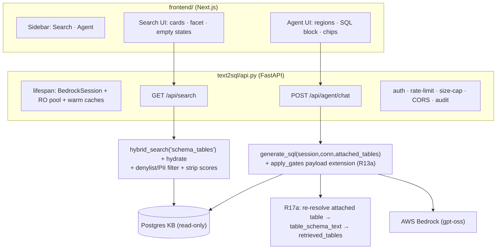
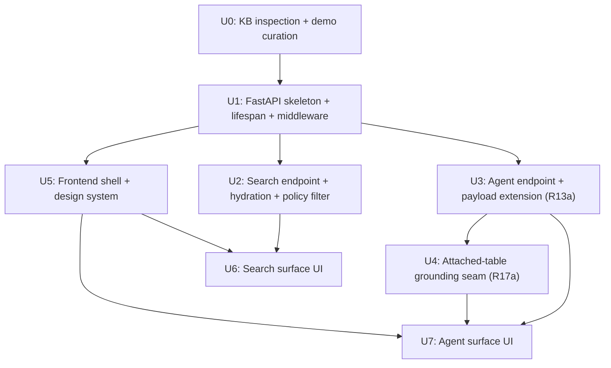

# feat: BRISA Prototype — Data Search Engine + AI Data Agent Platform

## Overview

Build a new prototype web platform ("BRISA") with two analyst-facing surfaces — a **Data
Search Engine** (semantic table search, no LLM) and an **AI Data Agent** (draft SQL, never
executed) — on a **FastAPI** backend that wraps the existing `text2sql/` package and a new
**Next.js/React** frontend. The backend reuses `retrieval.hybrid_search` and
`agent.generate_sql`; the search surface adds a hydration + policy-filter layer; the agent
surface adds an additive payload extension so grounding/coverage signals become visible UI
trust artifacts. No SQL is executed and no Postgres data is modified.

## Problem Frame

The current `text2sql` proof-of-concept is a CLI plus a stdlib `web.py` chat page. To make the
BRISA proposal credible to BRI stakeholders we need a polished two-surface platform that
presents Lapisan 2 (search) and Lapisan 3 (agent). See origin:
`docs/brainstorms/2026-07-16-brisa-prototype-search-and-agent-requirements.md`. Lapisan 1
(metadata generation) is out of scope; the demo's legibility is bounded by whatever metadata
already exists in the KB, so the plan opens by inspecting it.

## Requirements Trace

Carried from the origin requirements doc (R# match the origin):

- R1/R2. New Next.js + FastAPI app separate from `web.py`; two explicit endpoints; **no**
  `orchestrator.py` router — each endpoint calls its logic directly.
- R3. No execution, no Postgres writes; reuse `retrieval.py`/`agent.py`/`gates.py`/PII
  redaction, adding only additive, backward-compatible code.
- R4/R4a. Search = pure semantic retrieval (ranking via `hybrid_search`) + hydration; the
  search endpoint applies `TABLE_DENYLIST` + `redact_note` and strips numeric scores.
- R5/R5a/R6/R7/R8/R9. Table cards (graceful headline fallback), honest PII badge, no numeric
  score + "matched on", expandable columns from `columns_dict`, domain facet from
  `domain_tags`, cold-session-safe empty states.
- R10/R11/R13/R13a/R14/R15. Agent reuses `generate_sql`; structured response; grounding chips
  + grounding-strength label backed by a **new additive payload** (per-table status + cosines).
- R12/R23. Read-only SQL block, no Run, on-block draft badge; specific in-context caveat.
- R16/R17/R17a/R30. Sidebar; table→agent cross-link with a server-re-resolved grounding
  seam; mis-picked-surface escape hatch. **R18 (bidirectional back-links) is P2 — deferred, not
  assigned to a build unit.**
- R19/R20/R21/R22/R28. Bilingual layout, shadcn rethemed, IBM Plex + tabular figures,
  restrained color + amber warning, desktop-min + accessibility baseline.
- R24/R27. One-shot ambiguity handling (editable assumptions, no clarify-back); interaction
  states (loading / decline / backend-error).
- R25/R26. Auth behind corporate identity; audit reuse + body-size cap + rate limiting.

Success criteria (from origin):
- A curated set of ~10–15 representative ID/EN analyst questions runs end-to-end; target table
  in search **top-5 for ≥80%**; each produces a clearly-draft SQL artifact.
- One-session flow search → agent-pre-scoped → draft SQL, **no execution**.
- Search returns tables with no LLM call, no Postgres writes, **no denylist/PII leakage**.
- Agent reproduces `generate_sql` faithfully; never-execute visible in UI.
- Passes `frontend-design` litmus checks.

## Scope Boundaries

- Lapisan 1 metadata generation — out of scope; metadata/embeddings consumed as-is.
- No SQL execution, no data-row return; no Postgres writes; read-only role only.
- `orchestrator.py` router not invoked; CLI and `web.py` remain but are not the deliverable.
- No persistence layer: no History, "recent searches", or "most-used tables".
- No multi-turn memory or clarify-back loop beyond `generate_sql`.
- Example SQL from precedents excluded from search cards (decided) — the "Ask the agent about
  this table" cross-link (R17) is the path to see how a table is queried.
- Full responsive/mobile reflow out of scope (desktop-min per R28).

## Context & Research

### Relevant Code and Patterns

- `text2sql/web.py` — stdlib server to supersede. **Port two patterns:** the double-checked
  **lock-guarded shared session** (`_session_lock`, `_shared_session()`, lines 26–28, 772–783)
  and **`result_to_payload()`** (lines 786–810), the `Text2SQLResult`/`SearchResult`→JSON seam
  to extend. Also the 64 KB body cap (`do_POST`) for R26.
- `text2sql/retrieval.py` — `hybrid_search(kb, question, *, limit, pool, conn)` returns
  `[{id, score, dense_cosine, bm25}]`; `top_dense_cosine(rows)` is the coverage signal.
  `ALLOWED_KBS` guards the KB name — the search endpoint must only ever pass `"schema_tables"`.
  `_vocab_cache` is an unlocked module global → warm at startup.
- `text2sql/tools.py` — hydration precedents: `search_schema` meta fetch
  (`SELECT id, table_name, table_description FROM schema_tables WHERE id = ANY(%s)`),
  `_fetch_table_columns` (`schema_columns`), `_render_table_ddl`, and the
  `RetrievalContext`/`redact_note` seam. `get_table_schema`/`table_schema_text` is the retrieval
  path R17a must route through to make an attached table count as retrieved.
- `text2sql/agent.py` — `generate_sql(question, *, session, conn)`; `apply_gates` already
  computes `ctx.era_top_cosine()`, `ctx.schema_top_cosine()`, `decision.referenced_tables`,
  `ctx.retrieved_tables`, `known_tables(conn)` but does **not** surface them (this is R13a).
  `Text2SQLResult` fields listed at lines 39–53. `_session`/`_known_tables_cache` are unlocked
  globals.
- `text2sql/gates.py` — `TABLE_DENYLIST`, `RESTRICTED_FRAGMENTS`, `UNVERIFIED_MARKER`,
  `coverage_ok` floors (schema 0.40, ERA 0.45). Warnings are severity-tagged strings.
- `text2sql/embedding_service.py` — `pg_config(readonly=True)` (raises if `PG_RO_USER` unset;
  never falls back to superuser); loads `.env` at import; `embed_one` (BGE-M3, transient 503s).
- `text2sql/audit_log.py` — `get_logger(suffix)`, `new_request()` (sets a per-request id in a
  ContextVar; already called inside `generate_sql`/`answer_question`; the pure-search endpoint
  must call it itself for log correlation).
- Tests: root `conftest.py` does the `sys.path` shim (no packaging). `tests/test_web.py` =
  endpoint template via **injected fake generator** + in-process server. `tests/test_retrieval.py`
  = module-scoped `conn` fixture (`pg_config(readonly=True)`). `tests/test_gates.py` = unit-only.

### Institutional Learnings

- No `docs/solutions/` corpus exists. The primary institutional input is the origin brainstorm.
- `docs/setup-readonly-role.md`: `t2s_ro` has SELECT only on the 9 KB tables, no access to
  `era_tickets*`. Confirm whether it already excludes denylisted rows (hardens R4a for free).
- `RETRIEVAL.md`: authoritative column inventory — `schema_tables` has `domain_tags text[]`
  (GIN), `column_names text[]`, `n_columns`, `ai_generated`, `columns_dict` (full column dict in
  one row); `schema_columns` has `business_title`, `col_knowledge`, `domain_tags`. The `tid<N>`
  id artifact appears on the partial sample export (some column parent tables unresolved) —
  hydration/grounding must tolerate ids that don't resolve to a real table.

### External References

- None fetched. Next.js/FastAPI are well-established; UX best practices were already researched
  in the origin brainstorm; current shadcn/theming specifics are handled at build time by the
  `frontend-design` skill.

## Key Technical Decisions

- **FastAPI app at `text2sql/api.py`** (sibling to `web.py`/`cli.py`), run via
  `python -m text2sql.api`; add `fastapi` + `uvicorn[standard]` to `requirements.txt`. Matches
  the one-file-per-surface convention; no packaging change needed. Routers/models may live in
  small helper modules if `api.py` grows, but a single module is the baseline.
- **Shared resources built at app startup (lifespan), not via unlocked globals.** Build one
  `BedrockSession` and a **read-only connection pool** (`psycopg2.pool.ThreadedConnectionPool`
  from `pg_config(readonly=True)`); warm `_vocab_cache` + `known_tables`; pass `session=`/`conn=`
  into `generate_sql`. A single shared connection is not thread-safe — pool per request.
- **Search surface bypasses the agent entirely** — `hybrid_search("schema_tables")` + a new
  hydration layer + policy filter. No session, no LLM, no gates loop; but it **re-applies**
  `TABLE_DENYLIST` + `redact_note` (R4a) and strips cosine/RRF before serializing (R6).
- **Grounding/coverage signals surfaced additively (R13a).** Extend `Text2SQLResult` with an
  optional per-table grounding status list + `era_top_cosine`/`schema_top_cosine`, populated in
  `apply_gates`. The frontend consumes structured fields, never string-parses warnings. This is
  additive and backward-compatible (CLI/`web.py` ignore the new fields).
- **Attached-table cross-link routes through the real retrieval path (R17a).** `generate_sql`
  gains an optional `attached_tables` param; the server re-resolves each against `known_tables`
  + denylist, then calls `table_schema_text(ctx, t)` before the agent loop so it legitimately
  enters `retrieved_tables`. Direct injection into the accumulator is prohibited.
- **Frontend in a new top-level `frontend/` dir** (own `package.json`); **append**
  `node_modules/`, `.next/` to the **existing** repo `.gitignore` (which already covers
  `.env`/`.venv`) — do not recreate it. Next.js App Router + Tailwind + shadcn/ui rethemed off
  defaults; the Python tree does not constrain its layout.
- **Ambiguity is one-shot (R24).** The agent prompt forbids follow-up questions, so the UI leans
  on editable assumptions + re-submit; no clarify-back channel is added.

## Open Questions

### Resolved During Planning

- *Where does the FastAPI app live?* → `text2sql/api.py`, `python -m text2sql.api` (repo
  convention; no packaging).
- *Single shared connection vs pool?* → read-only **pool** (thread safety under Uvicorn).
- *How to surface grounding/coverage to the UI without string-parsing warnings?* → additive
  `Text2SQLResult` fields set in `apply_gates` (R13a).
- *How to keep the attached-table cross-link from weakening grounding?* → server re-resolve +
  route through `table_schema_text` (R17a).
- *Router?* → not used; explicit surfaces + R30 escape hatch.

### Deferred to Implementation

- **[Resolve Before Planning → first implementation step]** Live-KB inspection (Unit 0): actual
  `domain_tags` population rate, non-null business-title rate, PII-signal availability, and
  `tid<N>` prevalence — determines the realistic card/facet shape and the curated demo dataset.
  Cannot be answered without DB access; it is the first build step, not a product blocker.
- ~~Whether `t2s_ro` already excludes denylisted rows at the DB layer~~ **RESOLVED (Unit 0):**
  denylisted `era_tickets*` are blocked at the DB layer (42P01) for the read-only role — R4a is
  defense-in-depth.
- Exact auth mechanism (reuse Entra/OIDC vs a locked-down demo host) — decided at Unit 1 with
  stakeholders; the requirement (not public, authenticated) is fixed, the mechanism is not.
- Frontend↔backend origin/CORS config values and i18n string-catalog structure — settled while
  building Units 1/5.
- shadcn retheme tokens (type scale, radius, palette) — resolved at build time via
  `frontend-design`.

## High-Level Technical Design

> *This illustrates the intended approach and is directional guidance for review, not
> implementation specification. The implementing agent should treat it as context, not code to
> reproduce.*

Search response shape (directional): `{ query, results: [{ table_name, headline,
domain_tags[], description, pii_unclassified: bool, matched_on?, columns: [...] }] }` — no
numeric score. Agent response shape (directional): existing `result_to_payload` **plus**
`{ grounding: [{name, in_kb, retrieved}], era_top_cosine, schema_top_cosine,
grounding_strength: "precedent_strong"|"schema_only" }`.

## Implementation Units

- [x] **Unit 0: Live-KB inspection & demo-dataset curation** — DONE (see `docs/brisa-demo-dataset.md`)
  Findings: 4,438 tables; `domain_tags` 48.4% populated (23 domains); no table-level business
  title (headline → humanized `table_name`); column `business_title` 90.5% filled; `[AI]`
  boilerplate 0% and `tid<N>` 0% (both sample-only fears dispelled); 2,533 PII-fragment columns;
  denylist tables **blocked at the DB layer (42P01)** → R4a is defense-in-depth. Retrieval sanity
  check strong across 5 domains; formal top-5 KPI deferred (needs a labeled eval set — no re-scope).

**Goal:** Resolve the origin's *Resolve Before Planning* item: measure what metadata actually
exists so Units 2/6 build the realistic card/facet shape, and curate the demo query set.

**Requirements:** R5, R5a, R7, R8, R9, success-criteria demo set.

**Dependencies:** None (read-only DB access).

**Files:**
- Create: `scripts/inspect_kb.py` (one-off read-only inspection; not shipped in the app path)
- Create: `docs/brisa-demo-dataset.md` (curated tables + ~10–15 ID/EN demo questions)

**Approach:**
- Using `pg_config(readonly=True)`, measure over `schema_tables`/`schema_columns`: `domain_tags`
  populated rate + distinct domains; non-null table business-title rate; presence of any
  PII/sensitivity/certification column; `tid<N>` id prevalence; description boilerplate rate
  (`[AI]` prefix).
- Confirm whether `t2s_ro` can even SELECT denylisted rows (informs R4a).
- Curate a demo dataset of tables with real metadata and a fixed question list (drawn from the
  analyst survey in the repo) for the success-criteria top-5 measurement.
- **Decision gate (KPI reality check):** run the curated question set through
  `hybrid_search('schema_tables')` and record the actual top-5 hit rate. If it is **<80%** on the
  sample KB (e.g. target tables are `tid<N>`-unresolved or absent from the 200-row export),
  **re-scope before building Units 5–7** — request the full catalog export or restate the KPI as
  an explicit sample-bound number. This makes a bad inspection re-scope rather than silently ship
  an unmeetable success criterion.
- Record an explicit **fallback card/facet shape** (minimal headline from humanized `table_name`,
  domain facet hidden) for Units 2/6 to use when metadata is sparse.

**Test scenarios:** Test expectation: none — one-off inspection script + a docs artifact, no
shipped behavior. Verification is the written findings.

**Verification:** `docs/brisa-demo-dataset.md` states domain/business-title/PII coverage numbers,
the measured top-5 hit rate + re-scope decision, and the fallback card/facet shape; lists the
curated tables + demo questions; Units 2/6 reference it.

- [x] **Unit 1: FastAPI skeleton, lifespan resources, and security middleware** — DONE
  (`text2sql/api.py`, `tests/test_api_app.py`; 7 tests pass + live-KB smoke). Lifespan builds a
  read-only `ThreadedConnectionPool` + warms `known_tables`; Bedrock session eager-with-lazy-
  fallback (search decoupled from Bedrock); locked-down-host auth gate, 64 KB body cap,
  exact-origin CORS, per-request `new_request()` correlation, generic error envelope. Search/agent
  routers mounted as auth-guarded 501 stubs for U2/U3.

**Goal:** Stand up the app with shared resources built once and the R25/R26 controls in place.

**Requirements:** R1, R2, R3, R25, R26, R27 (error-state contract), R28 (CORS origin).

**Dependencies:** None — can build in parallel with Unit 0 (the app skeleton does not consume
Unit 0's findings; Unit 0 informs Units 2/6 card/facet shape only).

**Files:**
- Create: `text2sql/api.py` (FastAPI `app`, lifespan, routers mounted, `main()` → uvicorn)
- Modify: `requirements.txt` (add `fastapi`, `uvicorn[standard]`)
- Modify: `.gitignore` (append `node_modules/`, `.next/`; `.env`/`.venv` already covered — append-only, never overwrite)
- Test: `tests/test_api_app.py`

**Approach:**
- Lifespan builds one `BedrockSession` (mirror `web.py`'s lock-guarded singleton) and a
  `ThreadedConnectionPool` from `pg_config(readonly=True)`; warm `_vocab_cache` +
  `known_tables`; store on `app.state`. A dependency hands each request a pooled RO connection
  and returns it on completion (returned on every path, incl. errors). `pg_config(readonly=True)`
  **raises** if `PG_RO_USER` is unset — surface that as a clear startup failure, not a silent
  degrade.
- **Security posture = locked-down demo host (chosen).** Middleware/deps: a simple
  authentication gate on **both** routes (network-restricted host + reject-unauthenticated; no
  full SSO integration for the prototype), request-body size cap (64 KB, from `web.py`) plus a
  search query-length bound, **exact-single-origin CORS** (no wildcard, no origin reflection;
  `allow_credentials` only if the gate is cookie-based, paired with CSRF), and `new_request()`
  audit correlation. **Per-user rate limiting is deferred** as a documented interim risk (see
  Risks). Full-catalog schema visibility (any allowed user can browse all non-denylisted
  tables/columns) is an **accepted, documented demo risk** — not a production posture.
- Standard error envelope so R27 states (gate-decline vs backend/embedding error) are
  distinguishable by the frontend: return a **generic message + correlation id** to the client,
  never raw exception/stack text; ensure audit-log entries **scrub secrets and PII-redact** any
  logged question/snippet. `GET /healthz`.

**Patterns to follow:** `web.py` `_shared_session()` lock; `audit_log.get_logger`/`new_request`;
`pg_config(readonly=True)`.

**Test scenarios:**
- Happy path: app starts; `/healthz` returns ok; a pooled RO connection is acquired/released per
  request (assert via an injected fake pool).
- Edge case: body larger than 64 KB → 413/400 before handler runs.
- Error path: unauthenticated request → 401/403; rate-limit exceeded on agent route → 429.
- Integration: lifespan builds exactly one session under concurrent first-requests (no double
  build) — assert with a counting fake session factory.

**Verification:** `python -m text2sql.api` serves both routes behind auth; concurrent requests
reuse one session and distinct pooled connections.

- [ ] **Unit 2: Search endpoint — retrieval + hydration + policy filter**

**Goal:** Pure semantic table search returning policy-safe, score-free table cards.

**Requirements:** R4, R4a, R5, R5a, R6, R7, R8, R9.

**Dependencies:** Unit 1.

**Files:**
- Create: `text2sql/search_service.py` (ranking→hydration→filter; no LLM)
- Modify: `text2sql/api.py` (mount `GET /api/search`)
- Test: `tests/test_search_service.py` (DB-dependent, `conn` fixture), `tests/test_api_search.py`
  (endpoint via injected fake service)

**Approach:**
- Rank via `hybrid_search("schema_tables", q, conn=pooled_conn)` (only ever `"schema_tables"`).
- Hydrate ranked ids: `SELECT table_name, table_description, domain_tags, column_names,
  n_columns, columns_dict FROM schema_tables WHERE id = ANY(%s)`; columns for R7 come from
  `columns_dict` (fallback `schema_columns` by table_name). Tolerate/skip `tid<N>` ids.
- **Policy filter (R4a) — applied over ALL emitting paths** (main results, the column
  dictionary, and the R9 browse-by-domain + closest-related responses; these must not diverge):
  drop any row whose table is in `gates.TABLE_DENYLIST`; run `redact_note` over all free-text
  (descriptions, column notes). **Column names are structural, not free-text** — `redact_note`
  does not mask them, so a column literally named `nik`/`cvv`/`account_no` would ship verbatim;
  decide the column-name policy explicitly (mask/withhold names matching restricted fragments, or
  document schema-name exposure as an accepted demo risk — tie to the deployment-posture
  decision).
- **Avoid gate-logic drift:** `gates.policy_ok` short-circuits on the first restricted column and
  cannot enumerate PII columns for a per-column badge. Factor a shared classifier
  `gates.restricted_columns(cols) -> set[str]` used by **both** `policy_ok` and the search badge,
  so `RESTRICTED_FRAGMENTS` logic lives in one place (satisfies the "two read paths must not
  diverge" invariant). Emit `pii_unclassified` where no signal exists (R5a).
- Headline = business title if present else humanized `table_name` (R5). **Strip** `score`/
  `dense_cosine`/`bm25` at the boundary (R6); include an optional `matched_on` derived from
  matched column/term where available.
- Domain facet (R8): accept an optional `domain` filter → `WHERE %s = ANY(domain_tags)`;
  `browse-by-domain` + `closest related tables` (threshold-relaxed) for R9. Call `new_request()`
  for audit correlation.

**Patterns to follow:** `tools.search_schema` meta fetch, `_fetch_table_columns`, `redact_note`.

**Test scenarios:**
- Happy path: a KB concept query returns ranked cards with headline, domain_tags, description,
  columns; results ordered by rank; no numeric score field present.
- Edge case: query hitting a `tid<N>`-only table is skipped without error; empty query and
  domain-filtered-to-zero return the R9 empty/closest-related payloads.
- Error path (R4a): a denylisted table in the candidate set is **excluded** from results; a
  description containing PII (email/long digits) is redacted before serialization.
- Edge case (R5a): a column matching `RESTRICTED_FRAGMENTS` gets a PII badge; a table with no
  signal returns `pii_unclassified: true`, never a bare "safe".
- Integration: endpoint test with an injected fake service asserts the API contract (fields,
  no scores) without a live DB.

**Verification:** `/api/search?q=…` returns score-free, denylist-free, PII-redacted cards; a
denylisted table never appears even when semantically similar.

- [ ] **Unit 3: Agent endpoint + grounding/coverage payload extension (R13a)**

**Goal:** Wrap `generate_sql` and make grounding/coverage visible as structured UI fields.

**Requirements:** R10, R11, R13, R13a, R14, R15, R23, R24, R27.

**Dependencies:** Unit 1.

**Files:**
- Modify: `text2sql/agent.py` (`Text2SQLResult` additive fields; `apply_gates` populates them)
- Create: `text2sql/api_serializers.py` (extend/port `web.result_to_payload`)
- Modify: `text2sql/api.py` (mount `POST /api/agent/chat`)
- Test: `tests/test_agent_grounding_payload.py` (unit, no LLM — feed a crafted
  `Text2SQLResult`/`RetrievalContext`), `tests/test_api_agent.py` (endpoint via injected fake)

**Approach:**
- Extend `Text2SQLResult` with optional `grounding: list[{name,in_kb,retrieved}]`,
  `era_top_cosine`, `schema_top_cosine`, `grounding_strength`. Populate in `apply_gates` from
  `decision.referenced_tables`, `ctx.retrieved_tables`, `known_tables(conn)`, and the cosine
  accessors — additive, so CLI/`web.py` are unaffected.
- **Case normalization (load-bearing):** compute `in_kb`/`retrieved` on **lowercased** sets,
  mirroring the existing accumulator (`agent.py:190`) and `check_grounding`. `ctx.retrieved_tables`
  holds three casings (tools add `.lower()`; `search_schema` adds catalog case; ERA precedents add
  corpus case), so a naive comparison would render a genuinely-grounded table as not-retrieved —
  the exact false trust signal this surface must avoid. Pin the displayed `name` to a **single
  canonical source** (catalog casing from `known_tables`/`schema_tables`) so a table looks
  identical on a search card and an agent chip.
- `grounding_strength` field (R15): `precedent_strong` if `era_top_cosine ≥ 0.45` else
  `schema_only` if `schema_top_cosine ≥ 0.40` — mirrors `gates.coverage_ok` floors; never a
  numeric confidence. The UI (Unit 7) renders `precedent_strong` → **"Grounded in precedent
  (strong)"** and `schema_only` → **"Schema-only — verify carefully"** (R15 exact text), and must
  not visually contradict a `[LOW]` coverage warning emitted near the 0.40 floor.
- Serializer maps regions for R11 (interpretation ← `explanation`; assumptions ← `assumptions`)
  and preserves `warnings`, `UNVERIFIED_MARKER`, `precedent_ids`, `dialect`. Endpoint reuses the
  app-level session + pooled conn; R27 error envelope distinguishes gate-decline (`declined`)
  from Bedrock/embedding failures.

**Execution note:** Extend `Text2SQLResult` and `apply_gates` test-first — the grounding-status
derivation is the load-bearing new logic and must be pinned before the endpoint wraps it. Note:
`tests/test_agent.py`'s decline-asserting cases (never-retrieved / weak-coverage / unsafe-SQL)
predate the warn-don't-block change (commit 7f3aff1) and now over-assert declines — reconcile them
to expect warnings as part of this unit so the "backward-compat baseline" is actually green.

**Patterns to follow:** `apply_gates` accumulator block; `web.result_to_payload`.

**Test scenarios:**
- Happy path: a result whose referenced tables were all retrieved → every grounding entry
  `retrieved:true, in_kb:true`; `grounding_strength` reflects the cosines.
- Edge case: a referenced table never retrieved → that entry `retrieved:false` and appears in
  `grounding` (parity with the existing accumulator warning), not string-parsed.
- Edge case: a referenced table absent from KB → `in_kb:false`, no chip rendered downstream.
- Error path (R27): Bedrock/embedding failure → error envelope, not a fake decline; model
  self-decline / no-SQL → `declined` surfaced distinctly.
- Coverage-label: `era_top_cosine` 0.5/schema 0.5 → `precedent_strong`; era 0.2/schema 0.45 →
  `schema_only`; unchanged `Text2SQLResult` consumers still work (backward-compat assertion).

**Verification:** `/api/agent/chat` returns the existing draft plus structured grounding +
coverage fields; CLI/`web.py` still function unchanged.

- [ ] **Unit 4: Attached-table grounding seam (R17/R17a)**

**Goal:** Let a table selected in Search be attached to an agent question and count as grounded
without weakening the accumulator gate.

**Requirements:** R17, R17a.

**Dependencies:** Unit 3.

**Files:**
- Modify: `text2sql/agent.py` (`generate_sql(..., attached_tables=None)`)
- Modify: `text2sql/api.py` (agent route accepts `attached_tables`)
- Test: `tests/test_attached_table_grounding.py` (DB-dependent)

**Approach:**
- Add optional `attached_tables: list[str] | None` to `generate_sql`. For each name: **re-resolve
  server-side** against `known_tables(conn)` (case-insensitive) and reject if in `TABLE_DENYLIST`;
  for each valid one call `tools.table_schema_text(ctx, name)` **before** the agent loop so it
  enters `ctx.retrieved_tables` via the real retrieval path. Never inject a name directly into
  `retrieved_tables`.
- **DDL-to-model nuance:** `table_schema_text` seeds `retrieved_tables` (grounding) as a side
  effect, but to actually *inform the draft* its returned DDL text must be threaded into the agent
  input (e.g. prepended to the first message) — the side-effecting call alone only makes the table
  grounded, it does not put the DDL in front of the model. Do both.
- **Untrusted-input contract:** `attached_tables` must be a JSON array of strings, **N ≤ 10**,
  per-name length **≤ 128**, matching the catalog identifier shape; anything that does not resolve
  to a known, non-denylisted table is dropped and **never** passed into the prompt (blocks
  instruction-injection via crafted "table names").

**Execution note:** Start with a failing test asserting an attached-but-denylisted / unknown
table is rejected and never grounded.

**Patterns to follow:** `tools.table_schema_text`/`get_table_schema`; `known_tables`.

**Test scenarios:**
- Happy path: attaching a valid KB table pre-seeds `retrieved_tables`; a draft referencing it
  passes the accumulator without the agent re-searching it.
- Error path (R17a): an unknown table name is not resolved and never becomes grounded; a
  denylisted name is rejected (policy warning), never grounded.
- Edge case: multiple attached tables all seed; empty/oversized `attached_tables` handled.
- Integration: end-to-end `generate_sql(question, attached_tables=[t])` shows `t` in the
  grounding payload as `retrieved:true`.

**Verification:** Attaching a table makes it grounded only via the real retrieval path;
crafted/denylisted names cannot bypass the gate.

- [ ] **Unit 5: Frontend shell & design system**

**Goal:** Next.js app shell, sidebar nav, shared API client, and the rethemed design system.

**Requirements:** R16, R19, R20, R21, R22, R28, R30.

**Dependencies:** Unit 1 (API contract + CORS).

**Files:**
- Create: `frontend/` (Next.js App Router, Tailwind, shadcn/ui), `frontend/package.json`
- Create: `frontend/app/layout.tsx` (sidebar: Search · Agent), `frontend/lib/api.ts`,
  theme tokens, i18n scaffolding
- Modify: `.gitignore`

**Approach:**
- App Router with a persistent left sidebar (Search / Agent co-equal). Retheme shadcn tokens off
  defaults (neutral surface + single blue/teal accent; **distinct amber** for
  `UNVERIFIED_DRAFT`/warnings; avoid green as hero — R22); IBM Plex Sans/Mono, tabular figures
  (R21); 8pt grid, dense-but-calm (R20). Bilingual scaffolding + flexible-width controls for
  ~30–40% EN→ID expansion (R19). Desktop-min with a below-min message; a11y baseline (keyboard
  operability, focus states, non-color cue for the draft/warning state) (R28). Typed API client
  for both endpoints, including the R27 error envelope. R30 cross-surface nudges wired at shell
  level.

**Execution note:** Execution target: build via the `frontend-design` skill; verify visually
(screenshot) against the Module B "apps/dashboards" guidance.

**Patterns to follow:** origin brainstorm UI research; `frontend-design` skill Module B.

**Test scenarios:** Test expectation: minimal — visual verification via `frontend-design` (one
screenshot pass) that the shell/tokens render; a11y smoke (keyboard focus visible, draft state
has a non-color cue). No unit suite for pure scaffolding.

**Verification:** App shell renders with themed sidebar; tokens applied; below-min message shows;
API client reaches both endpoints.

- [ ] **Unit 6: Search surface UI**

**Goal:** The "Google for BRI data" surface — search bar, cards, columns, facet, states,
cross-link.

**Requirements:** R5, R5a, R6, R7, R8, R9, R17, R27, R30.

**Dependencies:** Units 2, 5.

**Files:**
- Create: `frontend/app/search/*` (page, `TableCard`, `ColumnDictionary`, `DomainFacet`,
  `FilterChips`, empty/zero states, skeleton loader)

**Approach:**
- NL search bar; single-column full-width ranked cards (headline + mono `schema.table_name`,
  badge row incl. honest PII state, description). Expandable in-card column dictionary (R7);
  left-rail single-select domain facet + persistent applied-filter chip bar (R8); "matched on"
  line, **no numeric score** (R6). Loading skeletons + filter-recompute dimming (R27); R9 empty/
  zero states (browse-by-domain, closest-related, filter-caused detection). Each card's "Ask the
  agent about this table" navigates to the Agent with the table as a context chip (R17) — passed
  to `attached_tables` on submit. R30 zero-result "Did you mean to ask the Agent?" nudge.

**Execution note:** Execution target: `frontend-design` skill; visual verification pass.

**Patterns to follow:** origin brainstorm §2 (catalog search UX); `frontend-design` Module B.

**Test scenarios:**
- Happy path: entering a query shows skeletons then ranked cards; expanding a card lazy-loads
  its columns; applying a domain chip filters and the chip is removable.
- Edge case: zero results shows reformulation + closest-related; a filter-caused empty state is
  labeled as such; no numeric score is ever rendered.
- Integration: "Ask the agent about this table" lands on the Agent with the table chip attached
  and included in the next submit (assert the navigation + attached_tables payload).
- A11y: search submit, facet toggle, chip removal, and column disclosure are keyboard-operable.

**Verification:** Analyst can search, filter by domain, inspect columns, and hand a table to the
Agent; visual pass against the search-UX guidance.

- [ ] **Unit 7: Agent surface UI**

**Goal:** The draft-SQL chat surface with trust artifacts and non-happy-path states.

**Requirements:** R11, R12, R13, R14, R15, R23, R24, R27, R30.

**Dependencies:** Units 3, 4, 5.

**Files:**
- Create: `frontend/app/agent/*` (page, `ResponseRegions`, `SqlBlock`, `SourceTableChips`,
  `AssumptionsPanel`, `GroundingStrengthBadge`, `ContextChip`, generating/decline/error states)

**Approach:**
- Full-width structured response in fixed regions: interpretation → assumptions → source tables
  → warnings → SQL draft (R11). `SqlBlock`: syntax-highlighted, expanded, read-only, on-block
  `UNVERIFIED DRAFT` badge, Copy + Edit, **no Run** (R12); specific in-context caveat (R23).
  `SourceTableChips` from the R13a `grounding` payload (grounded vs named-but-not-retrieved; none
  for not-in-KB) (R13); `AssumptionsPanel` prominent + visually distinct (R14);
  `GroundingStrengthBadge` from `grounding_strength` — never numeric (R15). Ambiguity = editable
  assumptions + re-submit, no clarify-back (R24). R27 states: generating (staged status/region
  reveal), gate-decline (SQL region collapses, decline + warnings prominent), backend/embedding
  error (retry, distinct from decline). Consumes an attached `ContextChip` (removable) from the
  Search cross-link; R30 empty-state pointer back to Search.

**Execution note:** Execution target: `frontend-design` skill; visual verification pass **plus a
small component/interaction test tier for the safety-critical artifacts** — visual-only checks
cannot prove these across all states. Assert programmatically: no element with run/execute
semantics renders in happy/decline/error states; grounding-chip presence maps 1:1 to the payload's
`{in_kb,retrieved}`; `grounding_strength` never renders a digit.

**Patterns to follow:** origin brainstorm §3–4 (text-to-SQL UX, trust framing);
`frontend-design` Module B.

**Test scenarios:**
- Happy path: a question yields the fixed regions with a read-only SQL block, draft badge, copy
  works, **no Run button** exists.
- Edge case: grounded vs named-but-not-retrieved chips render from the payload; a not-in-KB table
  produces no chip; `grounding_strength` renders as a label, never a percentage.
- Error path (R27): gate-decline collapses the SQL region and surfaces warnings; a backend/
  embedding error shows a distinct retry state.
- Integration: arriving from Search with a context chip includes it in the request and reflects
  it as grounded in the response.
- A11y: SQL block text is selectable/screen-reader exposed; warning state has a non-color cue.

**Verification:** Agent surface shows a clearly-draft, never-runnable SQL artifact with visible
grounding/assumptions/strength; decline and error states are distinct; cross-link chip flows end
to end.

## System-Wide Impact

- **Interaction graph:** New FastAPI app calls into `generate_sql`/`apply_gates`/`hybrid_search`;
  `Text2SQLResult` gains additive fields consumed by the new serializer and (harmlessly ignored
  by) `web.py`/`cli.py`. `generate_sql` gains an optional param (default `None` → unchanged
  behavior).
- **Error propagation:** R27 envelope must distinguish model self-decline / no-SQL (business
  outcome) from Bedrock/BGE-M3 failures (transient 503s → retryable) so the UI shows the right
  state.
- **State lifecycle risks:** Shared `BedrockSession` + connection pool built at startup; unlocked
  module caches (`_session`, `_known_tables_cache`, `_vocab_cache`) warmed at startup to avoid
  first-request races. Pool connections must be returned on every path (incl. errors).
- **API surface parity:** The denylist + PII redaction that were agent-only must now also guard
  the search surface (R4a) — the two read paths must not diverge in what they expose.
- **Integration coverage:** DB-dependent tests (search hydration, attached-table grounding) prove
  behavior mocks can't; endpoint tests use injected fakes for contract shape.
- **Unchanged invariants:** No SQL execution; no Postgres writes; read-only role; `gates.py`
  thresholds and warn-don't-block semantics; CLI and `web.py` behavior. `generate_sql`'s existing
  signature stays call-compatible (new param is keyword-optional).

## Risks & Dependencies

| Risk | Mitigation |
|------|------------|
| Thin sample metadata makes search cards look empty (null titles, `[AI]` boilerplate) | Unit 0 curates a demo dataset with real metadata; R5 headline falls back to humanized `table_name` |
| `domain_tags` unpopulated in live KB → facet has no data | Unit 0 verifies population first; if sparse, single-select facet degrades to browse-by-domain or is deferred |
| Search surface leaks denylisted/PII metadata (bypasses agent gates) | R4a policy filter in Unit 2 + confirm `t2s_ro` DB-level exclusions; endpoint test asserts exclusion |
| Attached-table cross-link weakens grounding | R17a re-resolves server-side + routes through real retrieval path; test rejects unknown/denylisted names |
| Concurrency races on unlocked module globals under Uvicorn | Build session + pool + warm caches at startup (lifespan); connection pool per request |
| BGE-M3 / Bedrock transient failures surface as confusing UI | R27 distinct error state with retry, separate from gate-decline |
| No prior auth/CORS/rate-limit art in repo | Prototype uses a locked-down demo host + simple auth gate (Unit 1); genuinely new but minimal work |
| **Accepted demo risk:** full-catalog schema visibility (any allowed user enumerates all non-denylisted table/column names — reconnaissance-sensitive in a bank) | Accepted for the locked-down demo and documented. **Before any real rollout:** add per-identity table/domain authorization allowlist |
| **Accepted demo risk:** search route unthrottled (embedding + pooled DB abusable; scraping/DoS) | Accepted behind the locked-down host. **Before rollout:** per-user rate-limit on **both** routes + per-user pool-acquisition quota |
| **Deferred hardening (production gate):** no real SSO/token validation, expiry, or fail-closed-on-IdP | Prototype host-locks instead. Production requires server-side token validation on both routes, session expiry, and fail-closed on auth-provider unavailability |
| Frontend polish scope large alongside two backend integrations | Phased delivery (backend Units 1–4 before UI 5–7); `frontend-design` skill drives build + visual verify |

## Phased Delivery

### Phase 0 — Ground truth
- Unit 0: inspect the live KB, curate the demo dataset. Gates the realistic shape of Units 2/6.

### Phase 1 — Backend
- Units 1–4: app skeleton + security, search endpoint, agent payload extension, grounding seam.
  Independently testable against the KB with no frontend.

### Phase 2 — Frontend
- Units 5–7: shell/design system, search surface, agent surface. Built via `frontend-design`
  with visual verification, consuming the Phase 1 contracts.

## Documentation / Operational Notes

- Update `README`/`CLAUDE.md` with the new `python -m text2sql.api` entrypoint, `frontend/` dev
  instructions, and the new env/CORS/auth expectations (R25/R26).
- Append `node_modules/` and `.next/` to the existing repo `.gitignore` (`.env` already covered).
- Operational: session/pool built at startup; document rate-limit + body-cap defaults and the
  demo auth posture (locked-down host vs SSO).

## Sources & References

- **Origin document:** [docs/brainstorms/2026-07-16-brisa-prototype-search-and-agent-requirements.md](../brainstorms/2026-07-16-brisa-prototype-search-and-agent-requirements.md)
- Reuse seams: `text2sql/web.py` (session lock, `result_to_payload`), `text2sql/retrieval.py`
  (`hybrid_search`, `ALLOWED_KBS`), `text2sql/tools.py` (hydration, `table_schema_text`),
  `text2sql/agent.py` (`generate_sql`, `apply_gates`, `Text2SQLResult`), `text2sql/gates.py`
  (`TABLE_DENYLIST`, `RESTRICTED_FRAGMENTS`), `text2sql/embedding_service.py` (`pg_config`).
- Column inventory: `RETRIEVAL.md` (`domain_tags`, `columns_dict`, `column_names`, `tid<N>`).
- Read-only role: `docs/setup-readonly-role.md`.
- Test templates: `tests/test_web.py`, `tests/test_retrieval.py`, `tests/test_gates.py`.
