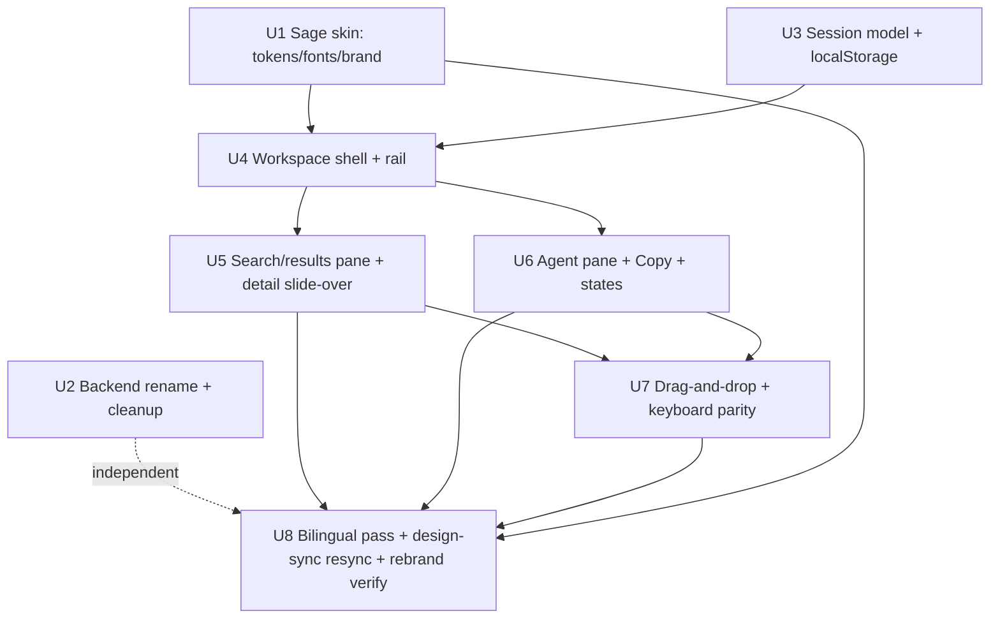

# feat: Sage redesign & rebrand of the BRISA search + agent console

## Overview

Rebrand the internal "BRISA" search-and-draft-SQL console to **Sage** and adopt the
`Sage.html` design: warm cream + terracotta theme, Instrument Sans + JetBrains Mono
typography, and a **single unified workspace** (Sessions rail + search results + agent panel,
with drag-and-drop of tables into agent context) replacing the current two-page
(`/search`, `/agent`) flow. Sessions persist to `localStorage`. Copy stays as the SQL
action — **no execution is ever added** (the mock's Run + results table are removed). UI copy
is bilingual (Indonesian primary, English secondary). Dead code and stray artifacts are
removed; `Sage.html` is archived, not deleted.

This is a **frontend-heavy** change. The backend work is a bounded rename + dead-code cleanup;
the request flow, endpoints, payloads, and the entire safety posture are unchanged.

## Problem Frame

The app works but wears an old identity (BRISA, slate/teal, IBM Plex) and a two-page flow
that forces navigation between searching for tables and drafting SQL against them. The Sage
design unifies these into one workspace and gives the product a distinct, warmer identity.
The core value proposition is unchanged: **draft SQL is never executed** — the analyst reviews
every draft and runs it elsewhere (see origin: `docs/brainstorms/2026-07-16-sage-redesign-requirements.md`).

## Requirements Trace

Carried from the origin requirements doc (R1–R19):

- R1. Rename product to **Sage** across user-facing surfaces; env vars / FastAPI title / log
  tags get an explicit decision, not an opportunistic sweep.
- R2. Typography → Instrument Sans (400/500/600) + JetBrains Mono, replacing IBM Plex.
- R3. Theme → warm cream canvas (`--bg #EAE6D9`), surfaces `#FBF9F3`/`#FFFDF8`, terracotta
  accent `#C96442`, blue links `#2F5AE0`; unverified-draft keeps a distinct warning treatment.
- R4. Favicon/app icon → Sage mark (terracotta rounded square + search glyph).
- R5. Single unified workspace replacing the two-page structure.
- R6. Sessions rail listing prior searches/chats; resume / start new.
- R7. Semantic search with a **Category** facet (a **UI-label-only rename** of the existing
  "domain" facet — the `SearchState.domain` field and `/api/search/domains` endpoint are kept
  as-is) + **Sort: Relevance**.
- R8. Result cards show Schema, Description, Columns (= `n_columns` count, not a name list).
- R9. Send-to-agent + table detail view (column dictionary + PII badges).
- R10. Conversational draft-SQL agent, restyled.
- R11. Drag-and-drop tables into agent context (+ button fallback), with full interaction states.
- R12. "Try asking" starter prompts in the empty agent state.
- R13. Draft SQL block keeps **Copy** as primary action; **no "Run"** control, no "coming soon".
- R14. Persist Sessions + contents to `localStorage`; a keyed session collection with
  quota/eviction (state-model change, not just serialization).
- R15. Bilingual copy: ID primary / EN secondary, scoped to nav + section labels only.
- R16. Draft-only posture preserved end to end (gates, read-only role, denylist,
  UNVERIFIED_DRAFT) — **non-negotiable, unchanged**.
- R17. Delete dead code/artifacts (`web.py`+`test_web.py`, `note.md`, `.xlsx`); **archive**
  `Sage.html`, don't delete.
- R18. Define non-happy-path states for both panes (loading/empty/zero-results/error;
  agent generating/complete/network-error/**gate-decline**).
- R19. `localStorage` data-at-rest safety, defined concretely against the real response fields
  (`SearchCard`/`ColumnInfo`/`AgentResponse`) — see Unit 3. The **sensitive asset is the BRI
  schema catalog itself** (table/column names + business meanings + drafted SQL), which the
  backend gates behind a read-only role; excluding only PII-flagged columns is not enough. Also:
  a **retention/TTL rule** (distinct from the eviction cap), a "Clear history" control, and a
  **recorded risk acknowledgement** (a docs/README note that unencrypted `localStorage` is the
  accepted at-rest store, why, and what is excluded).

## Scope Boundaries

- **No SQL execution.** No query runner, no results table, no change to gates or DB role.
- **No server-side sessions.** `localStorage` only; FastAPI stays stateless.
- **API contract preserved.** Existing endpoints (`/api/search`, `/api/search/columns`,
  `/api/search/table`, `/api/search/domains`, `/api/agent/chat`) and payloads unchanged.
- **Single default (terracotta) theme.** No alternate accent themes, no theme switcher.
- **Desktop-only** remains (below-min notice stays; retargeted to Sage).
- **No new backend request flow.** Backend work is rename + cleanup only.

## Context & Research

### Relevant Code and Patterns

- **Token-based theming (the key enabler).** Every component references colors via
  `--color-*` tokens defined in the `@theme` block of `frontend/app/globals.css`
  (`--color-bg/panel/panel-2/ink/muted/line/accent/accent-2/warn/warn-bg/warn-line/danger/ok/code`,
  `--font-sans/mono`). Components do **not** hardcode hex — **exception:** `SqlBlock.tsx` uses
  literal `#e8f1fb` / `#7d93ad` for code text. So the **colour** swap is mostly remapping token
  *values* in one file. The **font** swap is *not* one file: it coordinates three edits that must
  stay in lockstep or the fallback silently keeps IBM Plex — (1) `globals.css` `--font-sans/mono`
  values (currently `var(--font-plex-sans/mono)`), (2) the `next/font` imports in `layout.tsx`,
  and (3) the `<html className={...variable}>` classes in `layout.tsx`. Rename the `--font-plex-*`
  variables as part of the swap.
- **Fonts** wired in `frontend/app/layout.tsx` via `next/font/google` (`IBM_Plex_Sans`,
  `IBM_Plex_Mono` → CSS vars `--font-plex-sans/mono`), applied as `<html>` className variables.
- **Global client state** in `frontend/components/AppState.tsx`: a single `SearchState` +
  single `AgentState` in React context, mounted once in `layout.tsx`, in-memory only. This is
  the object that must become a keyed **session collection** for R6/R14.
- **Existing surfaces to fold into the workspace:** `app/search/page.tsx` (search + Category
  facet + cards; already has loading skeletons + zero-results handling), `app/agent/page.tsx`
  (chat, attach chips, `SqlBlock`, decline rendering, `assistantContext` history flattening),
  `app/table/[id]/page.tsx` (detail; already has loading/notfound/error states),
  `components/{Sidebar,TableCard,SqlBlock}.tsx`.
- **`SqlBlock` already embodies R13:** Copy + Edit buttons and the copy "Unverified draft — not
  executed … cannot access, run, or return data." There is **no Run button in the app today** —
  Run existed only in the mock. R13 is "restyle + keep Copy," not "remove a Run control."
- **Attach seam already exists:** search/detail push `?table=…`; agent `AgentInner` reads
  `?table` and de-dupes into `attached`. Backend caps `attached_tables` at 10 and de-dupes
  (`api.py` request model `max_length=10`). Drag-drop must reflect the same cap.
- **Backend rename surface (mapped):** env vars `BRISA_FRONTEND_ORIGIN` (`api.py:51`),
  `BRISA_API_TOKEN` (`api.py:115`; used in `tests/test_api_app.py`, `test_api_agent.py`,
  `test_api_search.py`); `FastAPI(title="BRISA")` (`api.py:228`); argparse description
  (`api.py:326`); docstrings/comments in `api.py`, `api_serializers.py`, `search_service.py`,
  `gates.py`, `agent.py`, `scripts/inspect_kb.py`, `requirements.txt`. **No log tags, no
  endpoint response strings.** `web.py` imported only by `tests/test_web.py`.
- **Design-sync `.ds-*` pipeline is decoupled from the app** (dot-prefixed → ignored by
  `next build`). **Note the two-directory split:** the config lives at **repo-root**
  `.design-sync/config.json` (holds `globalName: "Brisa"` + a `componentSrcMap`
  Sidebar/SqlBlock/TableCard/AppStateProvider → paths, + `runtimeFontPrefixes: ["Cascadia Code"]`),
  while `.ds-entry.tsx` and the `.ds-*` artifacts live under `frontend/`. `.ds-entry.tsx`
  re-exports those four components. Generated artifacts (`.ds-styles.css`, `.ds-fonts.css`,
  `.ds-fonts/*.woff2` — currently IBM Plex) regenerate via `node .ds-compile-css.mjs` /
  `node .ds-fetch-fonts.mjs`; the font regen must be pointed at JetBrains Mono + Instrument Sans
  and `runtimeFontPrefixes` updated. A stale map/barrel breaks the **next design-sync**, not the app.

### Institutional Learnings

- None. `docs/solutions/` does not exist in this repo. Consider seeding it via `ce:compound` if
  the redesign surfaces non-obvious gotchas (Tailwind v4 `@theme` pitfalls, Next 16 hydration
  mismatches from `localStorage`-backed context, `next/font` local-vs-google trade-offs).

### External References

- Not used. Local patterns are strong and `frontend/AGENTS.md` warns this Next.js build differs
  from training data — font sourcing and App Router specifics are resolved by reading
  `node_modules/next/dist/docs/` at implementation time, not web docs.

## Key Technical Decisions

- **Skin-first, then re-architect.** Land the theme/font/brand swap (Unit 1) as a standalone,
  low-risk "recognizably Sage" milestone before the structural workspace rewrite. **Durable U1
  work** (survives U4): `globals.css` tokens, `layout.tsx` font wiring + `metadata.title`,
  favicon, `SqlBlock` code colours. **Disposable U1 work** (U4 rewrites/deletes it): the
  `Sidebar` brand lockup and any `layout.tsx` grid shape — so U1 skips the Sidebar brand edit
  (U4 deletes the file) and `layout.tsx` is knowingly touched twice (fonts in U1, grid in U4).
- **`localStorage` design is a state-model change, not a wrapper.** `AppState` moves from a
  single active state to `{ sessions: Record<id, Session>, activeId }` with hydration on mount,
  serialization that **excludes** in-flight/non-serializable fields (`sending`) and R19-sensitive
  content, and quota/eviction (cap retained sessions, prune oldest). Rationale: naive
  `JSON.stringify(state)` would persist in-flight flags and grow unbounded past the ~5 MB quota.
- **Table detail = right-side slide-over.** In a dense single screen, detail opens as a
  slide-over (not a route, not a modal that blocks the agent) so the agent panel stays reachable
  (design-lens rec). `/table/[id]` is retired as a route; detail becomes an in-workspace panel
  keyed by physical name. **Drag-from-slide-over is resolved by scoping drag to result cards
  only:** attaching the table you're *viewing* uses a **Send-to-agent button inside the
  slide-over** (not drag), which sidesteps the known-hard HTML5 DnD conflict of dragging out of an
  overlay that sits over the drop region. Dragging a background card auto-dismisses the slide-over.
- **Session-switch while a request is in flight.** The in-flight agent request is bound to its
  **originating session id**; the completed (or failed) draft is written to *that* session, not
  the now-active one. Switching/creating a session is allowed during generation; the backgrounded
  session shows a subtle in-progress indicator in the rail, and its composer is disabled until the
  turn resolves. Rationale: `sending` is excluded from persistence, so an in-flight request needs
  an explicit home when its session is no longer active.
- **Empty-store first load.** On a genuine first visit (empty/corrupt/wrong-version store), seed
  **one active untitled session** so the rail always has exactly one selectable entry; the panes
  render their own empty states. The rail never shows zero rows. `clearHistory()` resets to this
  same single-session state.
- **One workspace route.** Collapse `/search` + `/agent` into a single route; `/` renders the
  workspace directly (drop the `redirect("/search")`). Selecting a Session swaps the **whole**
  workspace (search + results + agent conversation + attached tables) as one unit.
- **Env vars renamed `BRISA_*` → `SAGE_*`** (resolved during planning): the app is pre-release
  (not pushed, no PR), so a clean rename is low-risk. **But the trigger for the alias fallback is
  "any existing `.env`", not "a future deployment"** — an unset `SAGE_API_TOKEN` silently *opens*
  auth (the plan's own edge case), a security-relevant regression on a banking tool. So: (a) the
  **frontend is unaffected** — it reads `NEXT_PUBLIC_API_TOKEN`/`NEXT_PUBLIC_API_BASE`, not
  `BRISA_*`; (b) U2 greps any local/deploy `.env` for `BRISA_*` before renaming; (c) **ship the
  dual-read alias for one release by default**. Note `NEXT_PUBLIC_*` is inlined into the shipped
  JS bundle, so that shared bearer token is not a real secret — the network-restricted host is the
  actual control.
- **"Run" is not added.** Copy remains the only SQL action (R13). The mock's Run + results-table
  region is dropped; the vacated agent-panel space is filled by the conversation/draft flow.
- **Frontend test posture.** No JS test harness exists (package.json has only next/react/
  react-dom). **Standing up Vitest is its own bootstrap step** (own sub-step in U3 with its own
  verification): on this non-standard Next 16 / React 19 / Tailwind v4 build it needs a
  `vitest.config.ts` that resolves the `@/` alias and provides a `localStorage`/jsdom environment
  for `sessions.ts` — read `node_modules/next/dist/docs/` before choosing config (per
  `frontend/AGENTS.md`). Scope Vitest to **genuinely risky pure logic only** — the session
  serialize/evict/redact rules (U3) and the attach cap/dedupe (U7). **Do not** add a `lib/i18n.ts`
  module or test for the ~6 static bilingual labels (see bilingual decision below). UI/interaction
  units (layout, panes, drag-drop) are verified by **browser/manual** checks against the mock —
  no browser tooling in-env. Fallback if the harness fights the build: verify the pure logic
  manually rather than blocking on test-first.
- **Bilingual = inline label data, no abstraction.** R15 covers ~6 static nav/section labels.
  Follow the existing `Sidebar` `{label, sub}` inline pattern directly (or one shared `LABELS`
  constant) rendered with the existing two-span stack — **no `lib/i18n.ts` module, no i18n test**
  (there is no runtime language switch or pluralization to justify it). Enumerate the exact
  bilingual set once (see U8) so the ID/EN-vs-single-language classification is fixed, not
  per-implementer judgment.
- **Fonts via `next/font/google` if available, else local woff2.** Prefer the existing google
  pipeline; if this Next 16 build doesn't expose Instrument Sans, self-host the woff2 extracted
  from `Sage.html` via `next/font/local`. Decided at implementation after a quick spike.

## Open Questions

### Resolved During Planning

- **Env-var strategy** → rename `BRISA_*` to `SAGE_*` (pre-release app, no external consumers);
  update the 3 test files + docstrings + any `.env`/`.env.example`. Fallback: dual-read alias.
- **Table-detail presentation** → right-side slide-over, reachable during drag-to-attach.
- **Session-select semantics** → swaps the entire workspace (search + agent + attached) as a unit.
- **"Columns" on cards** → the `n_columns` integer count (no row count exists in `schema_tables`).
- **Does the app have a Run control today?** → No; Run was only in the mock. R13 needs no removal
  of app code, only "don't add it." (The existing **Edit** affordance stays — it edits in place,
  does not execute.)
- **"Category" facet** → a UI-label-only rename of the existing `domain` facet; `SearchState.domain`
  and `/api/search/domains` are unchanged.
- **Session-switch mid-generation** → the in-flight request completes into its origin session, not
  the active one; switching is allowed; backgrounded session shows an in-progress indicator.
- **Empty-store first load** → seed one active untitled session; the rail never shows zero rows.
- **Drag-from-slide-over** → avoided: drag is scoped to result cards; attach-from-detail uses a
  button; a background drag auto-dismisses the slide-over.
- **Design-sync ownership** → U8 owns all design-sync edits (config at repo-root, barrel under
  `frontend/`); U4 does not touch it.

### Deferred to Implementation

- **`next/font` Instrument Sans availability** in this Next 16 build — quick spike; fall back to
  `next/font/local` woff2 from `Sage.html` if the google import is absent. Verify woff2 subset
  covers Indonesian diacritics (R15).
- **Exact Sage token values + spacing** — extract from `Sage.html` (decoded once during
  brainstorm) and confirm against a rendered screenshot diff before archiving the file (R17).
- **Drag-and-drop mechanism** — native HTML5 DnD vs. a small library (none in `package.json`);
  choose during implementation, keeping the keyboard/button path as the accessible equivalent.
- **`localStorage` eviction thresholds** — concrete max-session count and pruning order, tuned
  against real serialized `AgentResponse` sizes.

## High-Level Technical Design

> *This illustrates the intended approach and is directional guidance for review, not
> implementation specification. The implementing agent should treat it as context, not code to
> reproduce.*

Workspace state shape (conceptual — names are directional):

```
AppState (localStorage-backed)
  sessions: { [id]: { id, title, createdAt,
                      search: { q, category, res },
                      agent:  { attached[], turns[] } } }   // note: no `sending` persisted
  activeId: string
  actions: newSession() · switchSession(id) · clearHistory() · updateActive(patch)

hydrate on mount:  read key "sage.sessions.v1" → validate/migrate → seed context
persist on change: debounce → strip non-serializable (sending) + R19-sensitive fields
                   → enforce cap (drop oldest beyond N) → write
```

Unified workspace layout (single route):

```
┌ Sessions rail ─┬─ Search + Results ───────┬─ Agent panel ───────┐
│ Sage brand      │ search bar               │ conversation        │
│ + Sort/Category │ Category facet           │ draft SQL (Copy)    │
│ session list    │ result cards ──drag──────┼──▶ attach context   │
│ New session     │  └ open → detail slide-over (overlays results) │
│ Clear history   │                          │ composer + Try asking│
└─────────────────┴──────────────────────────┴─────────────────────┘
   independently scrolling regions; ≥900px only (below-min notice otherwise)
```

Directional sizing (tune against `Sage.html`): rail fixed ~240px; results region min ~360px
(flexible); agent region min ~320px (flexible); detail slide-over ~420px overlaying the **results
region only** (not the agent panel). At the 900px floor, confirm a result card and the agent
composer stay usable; specify column reflow between 900px and wider viewports in U4.

## Implementation Units

Dependency graph:



- [ ] **Unit 1: Sage skin — theme tokens, fonts, brand, favicon**

**Goal:** Make the app recognizably "Sage" (warm cream/terracotta, Instrument Sans + JetBrains
Mono, brand text/metadata) without changing structure.

**Requirements:** R1 (user-facing brand: `metadata.title` + below-min notice only), R2, R3, R4.
(Bilingual copy, R15, is entirely U8 — U1 does no bilingual work.)

**Dependencies:** None. Land first.

**Files:**
- Modify: `frontend/app/globals.css` (`@theme` token values → Sage palette; body radial-gradient)
- Modify: `frontend/app/layout.tsx` (font imports Instrument Sans + JetBrains Mono; `metadata.title`
  → Sage; below-min notice brand → Sage)
- Modify: `frontend/components/SqlBlock.tsx` (replace hardcoded `#e8f1fb`/`#7d93ad` code colors
  with token-based `--color-code` + code-text tokens; keep Copy/Edit). **U1 owns all SqlBlock
  colour work; U6 only verifies** the result — they must not both restyle it.
- Note: the `Sidebar` brand lockup is **not** edited here (U4 deletes `Sidebar` and builds the
  Sage-branded rail). U1's brand work is limited to `metadata.title` + the below-min notice.
- Modify: `frontend/app/favicon.ico` (+ any icon asset) → Sage mark
- Reference (extract, do not delete): `Sage.html`

**Approach:**
- Extract the default (terracotta) theme tokens from `Sage.html` (`--bg #EAE6D9`, `--pane
  #F5F1E7`, `--surface #FBF9F3`, `--card #FFFDF8`, accent `#C96442`, link `#2F5AE0`, chip/
  divider/text scale) and map them onto the existing `--color-*` names so all components inherit
  the new look with no per-component edits. Add `--color-code` + code-text tokens for the SQL block.
- Font spike: try `next/font/google` for Instrument Sans / JetBrains Mono; if unavailable in this
  Next 16 build, self-host woff2 from `Sage.html` via `next/font/local`.

**Execution note:** Confirm token values against a rendered screenshot of `Sage.html` before
proceeding (acceptance gate for R17 archival).

**Patterns to follow:** the existing `@theme` block and `--font-plex-*` variable wiring in
`globals.css` + `layout.tsx`.

**Test scenarios:**
- Test expectation: none — pure styling/config. Verify by browser: app renders cream/terracotta,
  Instrument Sans + JetBrains Mono load, tab title reads "Sage", SQL block legible on the new code
  surface, unverified-draft warning still visually distinct from normal chrome.

**Verification:** App is unmistakably Sage; no slate/teal or IBM Plex remains in rendered UI; no
layout regressions; existing pages still function.

---

- [ ] **Unit 2: Backend rename + dead-code/artifact cleanup**

**Goal:** Rename BRISA→Sage in backend user-facing/config surfaces, remove dead code, archive
`Sage.html`. No request-flow or safety change.

**Requirements:** R1 (backend), R16 (unchanged — verify), R17.

**Dependencies:** None (parallel to U1).

**Files:**
- Modify: `text2sql/api.py` (`FastAPI(title=...)` → Sage; argparse description; env-var names
  `BRISA_FRONTEND_ORIGIN`→`SAGE_FRONTEND_ORIGIN`, `BRISA_API_TOKEN`→`SAGE_API_TOKEN` **with a
  one-release dual-read alias**; docstrings)
- Modify: `tests/test_api_app.py`, `tests/test_api_agent.py`, `tests/test_api_search.py` (env-var
  references)
- Modify: `README.md` (**lines 58–59 invoke `python -m text2sql.web`, which this unit deletes** —
  update the run instructions; also renamed env vars)
- Modify: `frontend/lib/api.ts` + `.env` — decide the frontend `NEXT_PUBLIC_API_TOKEN` /
  `NEXT_PUBLIC_API_BASE` naming (keep, or rebrand to `NEXT_PUBLIC_SAGE_*`); it must stay in
  lockstep with the backend token or auth silently opens/breaks
- Modify (opportunistic docstrings): `text2sql/api_serializers.py`, `search_service.py`,
  `gates.py`, `agent.py`, `scripts/inspect_kb.py`, `requirements.txt`
- Modify: `.env` / add `.env.example` if present (env-var keys)
- Delete: `text2sql/web.py`, `tests/test_web.py`, `note.md`, `Pengalaman Analis Data BRi (Responses).xlsx`
- Archive (do not delete): `Sage.html` → commit to a versioned design-assets location (e.g.
  `docs/design/sage-source.html`) with a note

**Approach:**
- **Before renaming:** grep any local/deploy `.env` for `BRISA_*`; ship a one-release dual-read
  alias (accept both `BRISA_*` and `SAGE_*`) so a stale `.env` can't silently open auth (unset
  `SAGE_API_TOKEN` → auth-open) or break CORS.
- Rename env vars in lockstep with the tests that set them. Keep behaviour identical (same
  defaults, same auth logic). Confirm no endpoint response, gate, or log string changes.
- Keep the frontend token (`NEXT_PUBLIC_API_TOKEN`) in lockstep with whatever the backend token
  becomes; the U8 rebrand grep must cover both.
- Delete `web.py` + `test_web.py` together (confirmed: `web.py` imported only by that test) and
  fix the `README.md` run instructions that reference it.

**Execution note:** Characterization-safe — run the existing pytest suite before and after; the
only intended diffs are env-var key names and cosmetic strings.

**Patterns to follow:** existing `os.getenv(...)` call sites in `api.py`; existing pytest
`monkeypatch.setenv` usage in the API tests.

**Test scenarios:**
- Happy path: API tests pass with renamed `SAGE_API_TOKEN` (auth accepts valid token, rejects
  missing/invalid) and `SAGE_FRONTEND_ORIGIN` (CORS origin honored).
- Edge case: unset token env var → same "auth disabled/open" behavior as before the rename.
- Error path: invalid token → 401/403 unchanged.
- Regression: full backend suite (incl. gate tests) stays green — R16 posture provably intact.
- Cleanup: repo has no import of `text2sql.web`; suite has no reference to deleted `test_web.py`.

**Verification:** `pytest` green; `/openapi.json` title reads "Sage"; no `BRISA_*` env var remains;
deleted files gone with no broken imports; `Sage.html` archived in git history.

---

- [ ] **Unit 3: Session model + `localStorage` persistence + data-at-rest safety**

**Goal:** Restructure `AppState` into a keyed Sessions collection persisted to `localStorage`,
with hydration, quota/eviction, and R19 safety rules.

**Requirements:** R6 (session *state model* — the rail *UI* is U4), R14, R19.

**Dependencies:** None strictly; sequence after U1. Precedes U4.

**Files:**
- Create (config): `frontend/vitest.config.ts` + add Vitest devDeps + a test script —
  **bootstrap sub-step, done first**: resolve the `@/` alias + a `localStorage`/jsdom env; verify
  a trivial test runs green before writing `sessions.ts` tests. Read `node_modules/next/dist/docs/`
  per `frontend/AGENTS.md` before finalizing config.
- Modify: `frontend/components/AppState.tsx` (session collection + `activeId`; `newSession`,
  `switchSession`, `clearHistory`, `updateActive`; hydration + persistence effects; in-flight
  request bound to originating session id per the switch-mid-generation decision)
- Create: `frontend/lib/sessions.ts` (pure logic: serialize/deserialize, field-level R19
  exclusion, eviction/quota + TTL, schema version + migration guard)
- Create (test): `frontend/lib/__tests__/sessions.test.ts`

**Approach:**
- Keep pure, testable logic (serialize, redact, evict, migrate) in `lib/sessions.ts`; the context
  provider just wires effects to it.
- Persist under a versioned key (`sage.sessions.v1`). On hydrate: parse → validate → migrate/ignore
  unknown-version. On change: debounce → strip `sending` and any in-flight/error transients → apply
  R19 exclusions → enforce max-session cap (drop oldest) → write.
- R19 — **define "sensitive" per real field** (`SearchCard`, `ColumnInfo`, `AgentResponse`) and
  decide per-field what persists, not just "exclude PII-flagged." The schema catalog itself
  (physical names, business titles, column descriptions, drafted SQL that embeds table/column
  names) is the sensitive asset. Decide explicitly whether the full column dictionary and drafted
  SQL persist or are stripped/minimized; note that free-text turns may quote literal identifiers
  or values. Persisting less is safer.
- **Retention/TTL** distinct from the size cap: drop sessions older than N days on hydrate, in
  addition to pruning oldest beyond the count cap.
- **Recorded risk acknowledgement:** a short docs/README (or `docs/security` note) stating
  unencrypted `localStorage` is the accepted at-rest store, why, and exactly what is excluded —
  the auditable governance deliverable for R19 (authored here or in U8, but owned).
- Expose `clearHistory()` for the UI "Clear history" control (wired in U4); it must purge the
  persisted store *and* any in-memory copies.

**Execution note:** Implement `lib/sessions.ts` test-first — the serialization/eviction/redaction
rules are the highest-risk logic and are pure-unit-testable.

**Patterns to follow:** existing `AppState` context shape and `use client` provider mounting.

**Test scenarios:**
- Happy path: create session → update search+agent → serialize → deserialize yields equal state
  (minus excluded fields).
- Happy path: `switchSession` changes `activeId` and surfaces that session's search+agent.
- Edge case: `sending: true` in memory is never written to `localStorage`.
- Edge case: R19 field-level — the persisted `search.res` and turn `response` are stripped/
  minimized to the agreed field set (e.g. PII-flagged column detail excluded); the concrete strip
  is asserted on real `SearchCard`/`AgentResponse` shapes.
- Edge case: exceeding the session cap prunes the oldest; newest retained.
- Edge case: TTL — a session older than the retention window is dropped on hydrate.
- Edge case: hydrating from empty / corrupt / wrong-version `localStorage` → clean initial state
  (seed one active untitled session), no throw.
- Edge case: an in-flight request whose session is switched away completes into its **origin**
  session, not the active one.
- Integration: `clearHistory()` empties persisted store and resets to a single new session.

**Verification:** Refresh restores the Sessions list and active session; in-flight flags never
persist; store stays under the cap; corrupt store degrades gracefully; `lib/sessions.ts` tests pass.

---

- [ ] **Unit 4: Unified workspace shell + Sessions/Category rail**

**Goal:** Replace two-page routing + Sidebar with one workspace route: a Sessions+Category rail,
a search/results region, and an agent panel visible together.

**Requirements:** R5, R6 (session rail *UI* — the state model is U3), R15 (rail labels).

**Dependencies:** U1 (skin), U3 (session model).

**Files:**
- Modify: `frontend/app/layout.tsx` (grid shell → rail + workspace main; mount new rail instead of
  `Sidebar`; three-region template — see the sizing note in High-Level Technical Design)
- Modify: `frontend/app/page.tsx` (render the workspace at `/`; drop `redirect("/search")`)
- Create: `frontend/components/SessionsRail.tsx` (Sage brand, session list, New session, Clear
  history, Category facet, Sort control)
- Delete/replace: `frontend/components/Sidebar.tsx` (dissolved into the rail)
- **Do not remove** `frontend/app/search/`, `frontend/app/agent/`, `frontend/app/table/` here —
  they stay as the reference logic until U5/U6 finish porting them into panes, then those units
  (and U8 final cleanup) delete them. This avoids deleting ~470 lines of behaviour before the
  units that reproduce it run.

**Approach:**
- One route renders three independently scrolling regions at ≥900px; below-min notice retained
  (retargeted to Sage). Selecting a Session swaps the **whole** workspace (search + results +
  agent conversation + attached tables) via `switchSession`. Consumes U3's `AppState` actions
  (`newSession`, `switchSession`, `clearHistory`, `updateActive`).
- On empty store, seed one active untitled session (rail never shows zero rows). Wire
  `clearHistory()` (from U3) to a rail control. Category facet (UI relabel of `domain`) + Sort
  move here from the old search page — a state-plumbing move, not a copy.
- Specify column reflow between the 900px floor and wider viewports.
- Design-sync (`config.json` map/`globalName`, `.ds-entry.tsx` barrel) is **not** touched here —
  it is owned entirely by U8 (decoupled from the app; won't block U4).

**Patterns to follow:** existing `layout.tsx` grid (`grid-cols-[248px_minmax(0,1fr)]`) and the
`usePathname`-based active state (now session-based).

**Test scenarios:**
- Manual/browser: all three regions render together at ≥900px; below 900px shows the Sage
  below-min notice.
- Manual/browser: New session clears the workspace; switching sessions restores that session's
  search + agent + attached tables together.
- Manual/browser: Clear history empties the rail and `localStorage`.
- Integration (light): rail reflects sessions created by search/agent activity in U5/U6.

**Verification:** No page navigation between search and agent; rail drives session lifecycle; `/`
is the workspace; a first-load empty store shows exactly one active session. (The old route dirs
still exist at this point — they're removed by U5/U6/U8 once ported.)

---

- [ ] **Unit 5: Search + results pane with detail slide-over and states**

**Goal:** Port search into the workspace: Category facet, Sort: Relevance, Sage result cards,
Send-to-agent, table-detail slide-over, and full R18 states.

**Requirements:** R7, R8, R9, R18 (search states).

**Dependencies:** U4, U3.

**Files:**
- Create: `frontend/components/SearchPane.tsx` (migrated from `app/search/page.tsx`)
- Modify: `frontend/components/TableCard.tsx` (Sage restyle; "Columns" = `n_columns` count;
  Send-to-agent action; drag handle affordance readied for U7)
- Create: `frontend/components/TableDetailPanel.tsx` (slide-over migrated from `app/table/[id]/page.tsx`)
- Modify: `frontend/lib/api.ts` (only if a call signature moves; contract unchanged)

**Approach:**
- This is a **refactor, not a copy**: reuse `searchTables` / `listDomains` / `tableDetail` and the
  existing zero-results / `filter_caused_empty` / closest-related logic, but rewire from route +
  `?table=` URL state to session-scoped context (`domain` field kept; "Category" is a label only).
  Convert `/table/[id]` from a route into the slide-over panel keyed by physical name.
- Detail opens as a right-side slide-over overlaying **the results region only**, leaving the
  agent panel reachable. Attaching the table *being viewed* uses a Send-to-agent button **inside**
  the slide-over (not drag); dragging a background result card auto-dismisses the slide-over
  (see the slide-over/drag decision in Key Technical Decisions).
- Enumerate states explicitly (R18): initial empty, loading skeleton, zero-results (with suggested
  action), API error/retry.
- Once the pane passes its browser checks, delete `frontend/app/search/` and
  `frontend/app/table/[id]/` (the reference logic U4 deliberately left in place).

**Patterns to follow:** `app/search/page.tsx` `Skeletons`, `EmptyState`, facet + card rendering;
`app/table/[id]/page.tsx` loading/notfound/error branches.

**Test scenarios:**
- Manual/browser: query returns cards (Schema/Description/Columns count), Category facet filters,
  Sort control present.
- Manual/browser: zero-results shows the distinct empty state; API error shows retry.
- Manual/browser: opening a card slides in the detail panel (columns + PII badges); agent panel
  stays reachable behind it.
- Manual/browser: Send-to-agent adds the table to the active session's `attached`.

**Verification:** Search behaves as before but in-pane; detail is a slide-over, not a route; all
four search states render correctly.

---

- [ ] **Unit 6: Agent pane — restyle, Copy, Try-asking, and R18 states incl. decline**

**Goal:** Port the agent conversation into the workspace panel, restyled to Sage, with the
draft-SQL Copy block, "Try asking" prompts, and all agent states.

**Requirements:** R10, R12, R13, R18 (agent states).

**Dependencies:** U4, U3.

**Files:**
- Create: `frontend/components/AgentPane.tsx` (a **refactor** of `app/agent/page.tsx` `AgentInner`:
  preserves `AgentResultCard`/`StrengthBadge`/decline/`assistantContext`/`tables_used` carry-forward
  but rewires the `?table=` attach seam onto session state)
- Verify (not restyle): `frontend/components/SqlBlock.tsx` — colour work is U1's; here confirm Copy
  is primary, the **Edit** affordance is retained (it edits the draft in place and does **not**
  execute — R16 holds), and no Run control exists
- Reuse: `frontend/lib/api.ts` `agentChat`, `assistantContext` flattening

**Approach:**
- Preserve the existing rich result rendering (interpretation, assumptions, grounding chips,
  warnings, decline path) and history flattening. Restyle to Sage. Add "Try asking" starter
  prompts in the empty state (R12).
- R18: distinct states for empty / generating / complete / network-error / **gate-decline** — the
  decline must read as an intentional safety hold (reuse the existing `declined`/`missing` payload),
  not a generic error. Handle the switch-mid-generation case per Key Technical Decisions.
- The mock's Run + results-table region is **not** built; the panel space is the conversation +
  draft flow. Note the SQL block's Copy is "the only action that *leaves the app*"; Edit stays but
  does not run — confirm the UNVERIFIED marker treatment when a user edits the draft.
- Once the pane passes its browser checks, delete `frontend/app/agent/`.

**Patterns to follow:** `app/agent/page.tsx` (`AgentResultCard`, `StrengthBadge`, decline block,
`submit`/history logic, carry-forward of `tables_used`).

**Test scenarios:**
- Manual/browser: ask a data question → draft SQL renders in the Sage SQL block; Copy works; no
  Run control anywhere.
- Manual/browser: empty state shows "Try asking" prompts.
- Manual/browser: a gate-declined response renders the decline state (distinct from network error).
- Manual/browser: follow-up refines using prior turns; attached tables carry forward.
- Manual/browser: network failure renders the agent error state.
- Guard (durable): a lightweight test/grep asserts `frontend/lib/api.ts` exposes **no execute/run
  endpoint** and the frontend issues no execute call — the "never execute SQL" invariant enforced
  by more than convention + manual check.

**Verification:** Agent works in-pane; Copy is the only action that leaves the app and there is no
Run control (Edit stays, edits in place, does not execute); decline and error are visually
distinct; UNVERIFIED_DRAFT marker preserved.

---

- [ ] **Unit 7: Drag-and-drop attach + keyboard parity**

**Goal:** Let analysts drag table cards into the agent context with full interaction states, with
the Send-to-agent button as the accessible equivalent.

**Requirements:** R9, R11.

**Dependencies:** U5, U6 (both panes exist).

**Files:**
- Modify: `frontend/components/TableCard.tsx` (drag source + grab affordance)
- Modify: `frontend/components/AgentPane.tsx` (drop target + drop-zone states)
- Modify: `frontend/components/AppState.tsx` (attach action already exists; enforce cap/dedupe)
- Create (test): `frontend/lib/__tests__/attach.test.ts` (pure attach/dedupe/cap logic if extracted)

**Approach:**
- Native HTML5 DnD unless a small library proves necessary. States: card grab affordance,
  drop-zone highlight on drag-start, valid-hover vs neutral, drop-success (table chip animates into
  the context list), and already-attached / over-cap (10) responses.
- **The client-side cap/dedupe is net-new work**, not a tweak: the current frontend only dedupes
  (`attached.includes(t)`) and does not cap; the cap of 10 exists only server-side
  (`api.py max_length=10`). Extract and enforce it client-side to mirror the backend.
- Drag is scoped to result cards (attach-from-detail uses the slide-over button — see Key
  Technical Decisions), so there is no drag-out-of-overlay conflict.
- Keyboard/accessible path: the Send-to-agent button reaches the same drop-success feedback, with
  an `aria-live=polite` region announcing attach-success (table name), already-attached, and
  cap-reached (10) for **both** the button and drag paths; the button carries a focus-visible
  confirmation and `aria-disabled` at cap. The drop-zone highlight is decorative (no SR equivalent).

**Patterns to follow:** existing `attached` chip rendering + removal in `app/agent/page.tsx`; the
backend `attached_tables` cap (`max_length=10`).

**Test scenarios:**
- Unit (if attach logic extracted): adding a duplicate is a no-op; adding beyond 10 is rejected;
  order preserved.
- Manual/browser: dragging a card highlights the drop zone; dropping adds the table with success
  feedback.
- Manual/browser: dropping an already-attached table shows the already-attached response, not a
  duplicate.
- Manual/browser: the 11th attach (drag or button) is refused with clear feedback.
- Manual/browser: keyboard-only user attaches via the button and gets the same confirmation.

**Verification:** Both attach paths work and agree; cap/dedupe enforced client-side; drop feedback
is unambiguous; keyboard path reaches parity.

---

- [ ] **Unit 8: Bilingual copy pass + design-sync resync + rebrand verification**

**Goal:** Apply the bilingual copy rule, finalize design-sync tooling for the renamed components,
and verify the rebrand is complete.

**Requirements:** R15, R1 (final sweep), R17 (verification).

**Dependencies:** U1, U5, U6, U7 (final UI exists). U2 (backend rename done).

**Files:**
- Modify: workspace components (`SessionsRail`, `SearchPane`, `AgentPane`, `TableCard`,
  `TableDetailPanel`) — bilingual labels as **inline `{label, sub}` data** (or one shared `LABELS`
  constant), following the existing `Sidebar` precedent. **No `lib/i18n.ts` module, no i18n test.**
- Modify: **repo-root** `.design-sync/config.json` (`globalName: "Brisa"` → "Sage";
  `componentSrcMap` for the Sidebar→SessionsRail rename; `runtimeFontPrefixes` for the new fonts)
  and `frontend/.ds-entry.tsx` (barrel exports). **U8 owns all design-sync edits** (U4 leaves it
  alone).
- Regenerate: `frontend/.ds-styles.css`, `frontend/.ds-fonts.css`, `frontend/.ds-fonts/*.woff2`
  (`node .ds-compile-css.mjs`, `node .ds-fetch-fonts.mjs`) — the font regen must source JetBrains
  Mono + Instrument Sans (share the same woff2 with U1's `next/font/local` fallback if chosen, to
  avoid two divergent font sources)

**Approach:**
- Apply the R15 rule and **enumerate the exact bilingual set** so classification isn't per-call
  judgment: stack ID/EN on the rail brand tagline, New session, Clear history, Category header,
  Sort header, Search section header, Agent section header, and "Try asking" header — and **only**
  those. Single-language for facet option values, card field labels, column-dictionary rows, chips,
  and SQL.
- Design-sync is decoupled from the app (won't block it); update the barrel + map + font prefixes
  so the next sync resolves, then regenerate artifacts.
- Final grep sweep: no `BRISA` (incl. env vars, front + back), slate-teal, or IBM Plex in
  user-facing surfaces.

**Patterns to follow:** existing `Sidebar` label/sub-label pattern (the design's precedent for
bilingual stacking).

**Test scenarios:**
- Manual/browser: exactly the enumerated nav + section headers show ID/EN; card fields, facet
  options, and column rows stay single-language (no doubling).
- Manual/browser: no residual "BRISA" (incl. env vars), slate/teal, or IBM Plex anywhere in the
  rendered app; the R19 risk-acknowledgement note exists in docs/README.
- Tooling: `node .ds-compile-css.mjs` + `.ds-fetch-fonts.mjs` regenerate cleanly with the new
  fonts; design-sync barrel/map + `runtimeFontPrefixes` resolve the renamed components/fonts.

**Verification:** Bilingual rule applied consistently and legibly; rebrand grep is clean;
design-sync inputs reference Sage + renamed components.

## System-Wide Impact

- **Interaction graph:** The attach seam changes from URL param (`?table=`) to in-workspace state
  (drag-drop + button → active session `attached`). All three former routes become panes reading a
  shared session; `switchSession` is the new cross-cutting entry point.
- **Error propagation:** Search/agent/detail each render their own R18 states; the gate-decline path
  (backend `declined`/`missing`) must remain visually distinct from network errors.
- **State lifecycle risks:** `localStorage` hydration must avoid an SSR/CSR hydration mismatch
  (persisted state only applied client-side after mount); serialization must strip `sending` and
  never grow past the quota (eviction). Corrupt/old-version stores must degrade to a clean state.
- **API surface parity:** None — the backend contract is unchanged; only env-var names and cosmetic
  strings move (Unit 2).
- **Integration coverage:** Session save/restore across refresh, and attach→agent→draft carrying the
  attached tables, are behaviors unit tests won't fully prove — verified in-browser.
- **Unchanged invariants:** All safety gates, the read-only DB role, the denylist, the
  `UNVERIFIED_DRAFT` marker, and the "never execute SQL" guarantee are untouched (R16). The API
  request/response shapes are preserved.

## Risks & Dependencies

| Risk | Mitigation |
|------|------------|
| `next/font/google` lacks Instrument Sans in this Next 16 build | Spike early (Unit 1); fall back to `next/font/local` woff2 from `Sage.html` |
| woff2 subset misses Indonesian diacritics (breaks R15 bilingual) | Validate glyph coverage before archiving `Sage.html`; screenshot-diff gate |
| `Sage.html` extraction is lossy (bundled artifact, bespoke template) | Archive, don't delete (R17); gate archival on screenshot-diff sign-off |
| `localStorage` hydration causes React hydration mismatch | Apply persisted state client-side post-mount; keep initial SSR render neutral |
| `localStorage` quota (~5 MB) exceeded by growing session history | Cap retained sessions + prune oldest; exclude heavy/sensitive payloads (R19) |
| Sensitive banking metadata persisted at rest on shared desktops | R19: exclusion rules + "Clear history" control + recorded risk acceptance |
| Full-workspace rewrite is a large single change | Skin-first (U1) + backend (U2) land independently; workspace built pane-by-pane (U4→U7) |
| Design-sync barrel/map goes stale after Sidebar dissolves | Update `config.json` + `.ds-entry.tsx` and regenerate in U8 (decoupled from app; non-blocking) |
| No frontend test harness → weak automated coverage | Add Vitest for pure logic (sessions/attach only); manual browser checks for UI |
| Vitest bootstrap fights the non-standard Next 16 / React 19 / Tailwind v4 build (`@/` alias, jsdom, ESM) | Treat harness standup as an explicit U3 sub-step with its own green-test gate; fall back to manual verification of pure logic if it blocks |
| Stale local/deploy `.env` still sets `BRISA_*` → unset `SAGE_API_TOKEN` silently opens auth | Ship a one-release dual-read alias by default; grep `.env` for `BRISA_*` before renaming; keep frontend `NEXT_PUBLIC_*` token in lockstep |
| Deleting old route dirs before panes are ported loses reference logic | U4 leaves route dirs in place; U5/U6 delete each only after its pane passes browser checks |

## Documentation / Operational Notes

- Update `README.md` run instructions (renamed env vars `SAGE_*`; removed `web.py`).
- Update `CLAUDE.md` where it names BRISA/env vars, if user-facing accuracy matters.
- Add a short note wherever `.env.example` lives documenting `SAGE_API_TOKEN` /
  `SAGE_FRONTEND_ORIGIN` (was `BRISA_*`), the one-release dual-read alias, and the frontend
  `NEXT_PUBLIC_*` token that must match.
- **R19 risk-acknowledgement note** (auditable governance deliverable): a short docs/README entry
  stating unencrypted `localStorage` is the accepted at-rest store for session data, why, and what
  is excluded.
- No migrations, no rollout gating (client-only persistence; internal desktop tool).

## Phased Delivery

### Phase A — Identity (parallel, low-risk)
- Unit 1 (Sage skin) and Unit 2 (backend rename + cleanup). Independent; either can land first.

### Phase B — Workspace core
- Unit 3 (session model + persistence) → Unit 4 (workspace shell + rail). **Order confirmed:**
  build the session model first so the rail is built once against the final state (chosen over
  "unify-before-persist," which would rework the rail/state when persistence lands).

### Phase C — Panes
- Unit 5 (search/results + detail slide-over) and Unit 6 (agent pane) — parallelizable after U4.

### Phase D — Interaction + finalize
- Unit 7 (drag-and-drop + keyboard parity) → Unit 8 (bilingual + design-sync + rebrand verify).

## Sources & References

- **Origin document:** [docs/brainstorms/2026-07-16-sage-redesign-requirements.md](../brainstorms/2026-07-16-sage-redesign-requirements.md)
- Design source (to archive): `Sage.html` (decoded tokens/fonts during brainstorm)
- Backend rename surface: `text2sql/api.py` (lines 51, 115, 228, 326), API test files
- Design-sync: `.design-sync/config.json`, `frontend/.ds-entry.tsx`, `frontend/.ds-*` pipeline
- Frontend state: `frontend/components/AppState.tsx`; SQL block: `frontend/components/SqlBlock.tsx`
